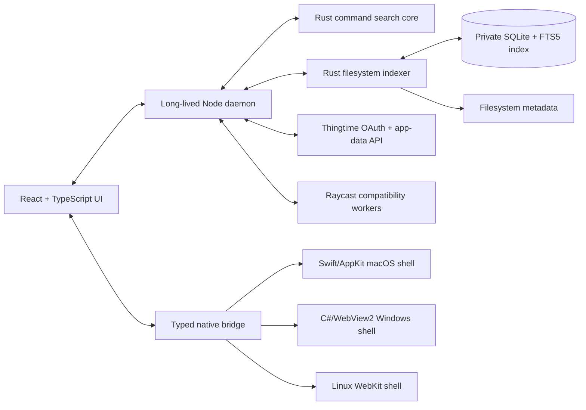

# Commander architecture

Commander is a keyboard-first desktop command launcher built as a shared product with thin native shells.
The architecture intentionally follows the Raycast 2.0 direction without coupling product logic to one OS.

## Runtime map

- **React/TypeScript** owns the launcher, actions palette, settings, extensions, and accounts UI.
- **Node.js** is the long-lived local control plane. It owns index scheduling, extension lifecycle, the loopback
  API, settings persistence, platform discovery adapters, and Thingtime sync requests.
- **Rust** owns deterministic command ranking plus a separate persistent filesystem metadata index. The reusable
  `commander-indexer` binary/library scans roots deterministically, inherits Git ignore rules, applies custom wildcard or
  regex exclusions, and queries a private SQLite/FTS5 database with the same typo-tolerant fuzzy scorer as commands.
  Both crates build for macOS, Windows, and Linux.
- **Swift/AppKit/WebKit** is the shipping macOS shell. It owns global shortcuts, native windows, the menu bar,
  launch-at-login, Keychain, file panels, application launching, activation, and lifecycle.
- **C#/.NET 8 + WPF/WebView2** is the Windows shell boundary. Its project and bridge contract live in `hosts/windows` so
  Windows support is implementation work, not an architectural rewrite.
- **Linux** uses the same daemon, UI, Rust binary, and bridge messages. Its host boundary is documented in
  `hosts/linux`; native integration can use WebKitGTK with a small Rust or C# shell.

## Trust boundaries

The daemon listens only on loopback and generates separate high-entropy UI and native tokens at each launch. Native
WebViews receive it in their initial URL; every mutation request requires it. Extension code executes in a
separate, bounded Node worker and never receives Thingtime credentials or the native bridge directly. Worker
threads contain lifecycle, crashes, timeouts, and JavaScript heap pressure; because they retain Node process
permissions, they are explicitly not an OS security sandbox.

Thingtime bearer tokens are credentials. The macOS shell persists them in Keychain under `{issuer, clientId,
userId}`. React is token-blind: a separate native-only daemon capability claims fresh tokens and unlocks saved ones
without returning bearer material to the renderer. The daemon never writes credentials to disk or logs request
authorization headers. Windows maps the same calls to Credential Manager; Linux should use Secret Service.

## One protocol

`packages/protocol` is the source contract for daemon, UI, Rust-facing models, and native bridge messages. The
shipping Swift bridge and the C# implementation contract mirror the same named methods; code generation and schema
conformance tests are the next portability gate. OS differences stop at that boundary. Per-command shortcut maps
and file drag requests cross this boundary as stable command IDs and absolute paths; only the native host registers
system hotkeys or constructs file-URL dragging sessions.

## Process lifecycle

1. The native host starts the bundled Node daemon on Commander's fixed loopback callback port and passes the
   bundled UI, Rust command-search, and Rust filesystem-indexer binary paths.
2. The daemon prints one JSON `ready` line containing the fixed callback port plus separate UI/native tokens.
3. The host creates the launcher and settings WebViews from that URL.
4. The daemon stays alive for the host lifetime; the host terminates the child process on exit.
5. Command candidates stream through the persistent Rust search child, avoiding per-keystroke process startup.
6. The daemon keeps separate filesystem-index reader and writer children against one WAL-mode SQLite database, so
   root search keeps using the last committed snapshot while a background scan is in progress.

The shared frontend builds separate entry points for Launcher and Settings. Settings is always a separate native
window. DOM overlays are acceptable only while they stay inside the launcher; platform popovers, action panels,
and tooltips move to native child windows when they need to escape bounds or preserve native focus semantics.

The launcher WebView stays warm between invocations and native compact/default mode changes resize the panel in
place. This keeps repeated global-shortcut presentation fast while preserving a separate settings window.

## IPC contract

| Link                  | Transport                                        | Required semantics                                                                                |
| --------------------- | ------------------------------------------------ | ------------------------------------------------------------------------------------------------- |
| React to native shell | WKWebView message handler / WebView2 postMessage | Correlation ID, 10-second timeout, bounded JSON values, one response per request                  |
| React to Node         | Authenticated loopback HTTP                      | Loopback only, per-launch 256-bit token, 1 MiB mutation cap, no-store responses                   |
| Native shell to Node  | Framed stdio handshake and process supervision   | Protocol version gate, ready deadline, one bounded restart, crash surfaced to UI                  |
| Node to search Rust   | Persistent JSON-lines stdio                      | Ordered requests/responses, structured error envelope, 64 MiB request cap, timeout/fallback       |
| Node to indexer Rust  | Correlated JSON-lines stdio                      | Request IDs, transactional scans, reader/writer isolation, bounded input and result counts        |
| Node to extension     | Worker messages                                  | Completion/error envelope, execution timeout, 128 MiB old-generation heap cap, forced termination |

The loopback UI-to-Node connection is an intentional Commander divergence from Raycast's primarily stdio topology:
it lets all three system WebViews reuse ordinary fetch without exposing a non-loopback listener. The native shell
still owns daemon supervision and capability negotiation.

## Extension render protocol

Each loaded extension command runs in its own `worker_threads` V8 isolate with a 128 MiB old-generation cap,
independent event loop, ephemeral instance ID, and explicit unload lifecycle. `@raycast/api` React components are
not mounted as untrusted DOM. A custom reconciler converts them to a platform-neutral render tree (`List`, `Grid`,
`Detail`, `Form`, `ActionPanel`) with callback IDs. Workers send ordered JSON Patch revisions; the Commander frontend
renders the trusted component vocabulary and sends events back by instance/revision/callback ID. Unsupported APIs
fail with a named compatibility error and appear in a per-command compatibility report.

The first MVP includes the isolation and manifest boundaries. Full view reconciliation is an explicit compatibility
gate before Commander may claim a view extension works.

## Performance budgets

- Warm launcher keypress-to-visible: p95 below 100 ms; cold first open below 700 ms on supported Macs.
- Hidden steady-state target: native shell below 50 MiB, Node below 100 MiB, WebContent below 150 MiB before extensions.
- Extension workers are lazy, unloaded after a grace period at root, and individually capped at 128 MiB old-gen.
- Icon/image caches are byte-bounded and modules outside the launcher path load lazily.
- Telemetry records process RSS/physical footprint, V8 heap, cold/warm presentation time, and daemon/Rust restarts.
- Filesystem scans default to two measured-optimal workers, 60% of total logical-CPU capacity, and a 512 MiB resident-memory ceiling;
  each limit is user-configurable and reported after a run.

## Filesystem indexing

The filesystem index is local device metadata, not Thingtime cloud data. It stores only path, display name, kind,
modification time, and size in `filesystem-index.sqlite3` with owner-only file permissions; it never reads file
contents. Commander indexes applications as a dedicated scope, then applications, files, and directories found in user-configured
roots. Application directories are watched for changes and reconciled every five minutes. Files and directories
reconcile in the background every six hours by default, after index-setting changes, or immediately through the
built-in Index Now commands. Hidden items are included and entry count is unlimited by default; Search Settings can
apply an explicit machine-local cap. The status reports the live SQLite/WAL/SHM footprint.

Each scan uses `ignore::WalkBuilder` with parent discovery enabled, so `.gitignore`, `.git/info/exclude`, and Git's
global excludes apply even when a configured root starts inside a repository. Additional glob and finite-automata
regex rules are compiled before scanning; an invalid rule rejects the new scan and preserves the previous committed
index. Descendant globs prune their matching directory, and the defaults skip macOS `.noindex` trees. Application
bundles plus macOS document/media package directories are indexed as one item and never recursively traversed.
Extensionless executables, aliases/hard links, symlinks, sockets, FIFOs, and device nodes remain searchable metadata
references; links are not traversed unless a standalone caller opts in. On-demand File Provider placeholder
directories are recorded without hydration. On macOS, indexing all of `~`
requires Full Disk Access; Commander links to that system pane, terminates a scan that remains blocked for 90
seconds, restarts its isolated writer, and leaves the previous committed snapshot available.

The standalone protocol accepts `resourceLimits` for traversal threads, parallel directory tasks, open directory
handles, total-machine CPU percentage, and resident memory. The pinned ignore walker holds at most one directory
iterator per worker, so the effective worker pool is the minimum of the thread, parallelism, open-directory, and
logical-CPU limits. A process-wide CPU-time governor pauses that pool when its duty-cycle window exceeds the selected
machine share. The memory limit also bounds the scan channel and SQLite page cache; an RSS breach aborts the current
transaction rather than publishing a partial replacement. Completed reports include effective limits, CPU time and
average share, peak RSS, memory sample count, and throttle duration. Unlimited scans receive a bounded 15-minute writer
window. Capped scans preserve the ordinary 90-second deadline at 25–100% CPU and proportionally extend it, up to 15
minutes, only for deliberately lower CPU limits.
If process CPU or RSS counters are unavailable, the standalone service fails closed rather than running unbounded.

`crates/commander-indexer` and `packages/filesystem-indexer` are host-independent. Another Thingtime desktop app can
use the CLI directly or import the typed Node client. Overlapping scans are serialized, optional entry caps are enforced, and
SQLite WAL lets queries remain responsive during a write transaction. Successful scans checkpoint and truncate the
WAL, every SQLite database/sidecar remains owner-only, and FTS tokenizes names rather than every full path to keep
large home indexes compact. Schema 3 also guards the FTS update trigger by filename equality, so the generation-only
writes in an unchanged reconciliation do not delete and recreate every trigram row. A source that reaches its cap
commits a bounded partial index and surfaces a warning
instead of leaving first-run search empty. Main search selection counts are a separate bounded, device-local daemon
state: exact-query frequency, global frequency, and recency add a capped boost across apps, commands, extensions, and
filesystem results without uploading search history. Coarse typo/path candidate scans are time-bounded, status uses
indexed row counts, the daemon retains the last good status across a transient failure, and the Node protocol client
restarts a timed-out reader before its next request. Filesystem event-level incremental updates are a future optimization; scheduled
reconciliation is the current cross-platform freshness guarantee.

Linux shares the protocol and product implementation but remains runtime-unverified until WebKitGTK, global-hotkey,
tray, accessibility, IME, drag/drop, and credential-store behavior have dedicated testing.

## Extension compatibility

Commander reads Raycast `extension.json`/`package.json` manifests without translation and indexes their commands.
Runtime execution is intentionally isolated behind `packages/raycast-compat`. Public Raycast API coverage is
tracked in `docs/RAYCAST_COMPATIBILITY.md`; unsupported APIs must fail with a named capability error, never silently.

## System shortcut providers

Operating-system destinations use the portable `system` search-item kind and live in platform-gated built-in
extensions. The first provider is **macOS System**, a curated global index of System Settings destinations such as
Accessibility permissions, Screen Recording, Full Disk Access, networking, displays, keyboard, and login items.
Selecting one returns the same narrow `application.open` native request used for other trusted URLs; the macOS host
opens an `x-apple.systempreferences:` deep link and Commander never automates or changes the setting itself. Because
the entries are ordinary extension commands, they participate in fuzzy search, History, Command-K, and per-command
global shortcut binding without adding another execution path.

Stable URL destinations exposed by third-party apps can join the same provider model. A universal “open app, then
choose this menu item” index is a different trust boundary: app menus are localized, may only exist while the app is
running, and require macOS Accessibility access to inspect or invoke. Commander must implement that as an explicit,
opt-in live Accessibility provider with app identity and menu-path validation rather than recording brittle mouse or
keyboard macros in the static system catalog.

## Distribution

The macOS build stages a signed `.app` containing compiled React assets, daemon/worker bundles, both Rust binaries,
the app icon, and a checksum-pinned Node 22 runtime, so the installed app does not depend on Homebrew Node or Cargo.

Architecture source: Raycast's official May 2026 technical deep dive describes this four-part hybrid topology,
typed IPC, WebView rendering workarounds, and measured memory trade-offs:
https://www.raycast.com/blog/a-technical-deep-dive-into-the-new-raycast
