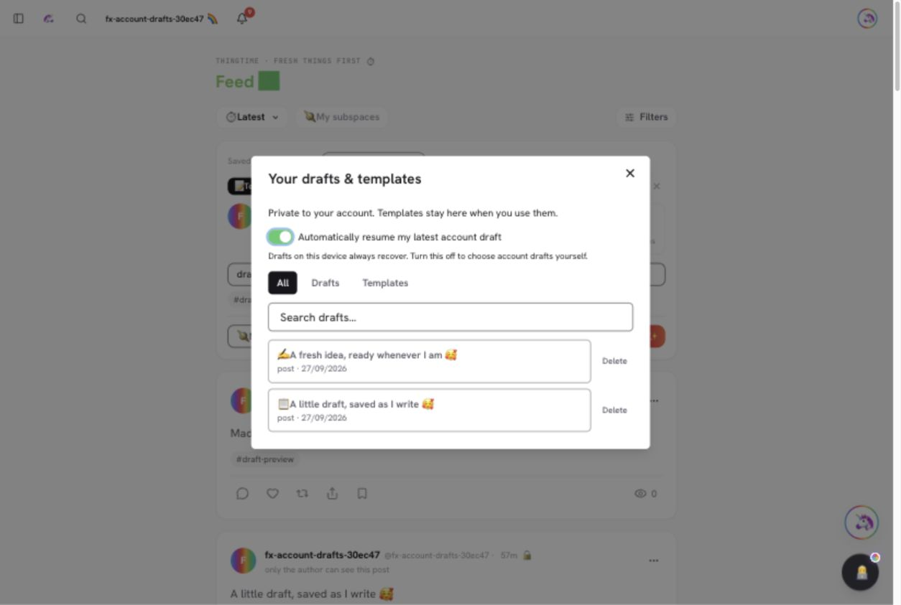
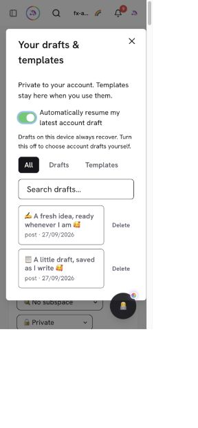
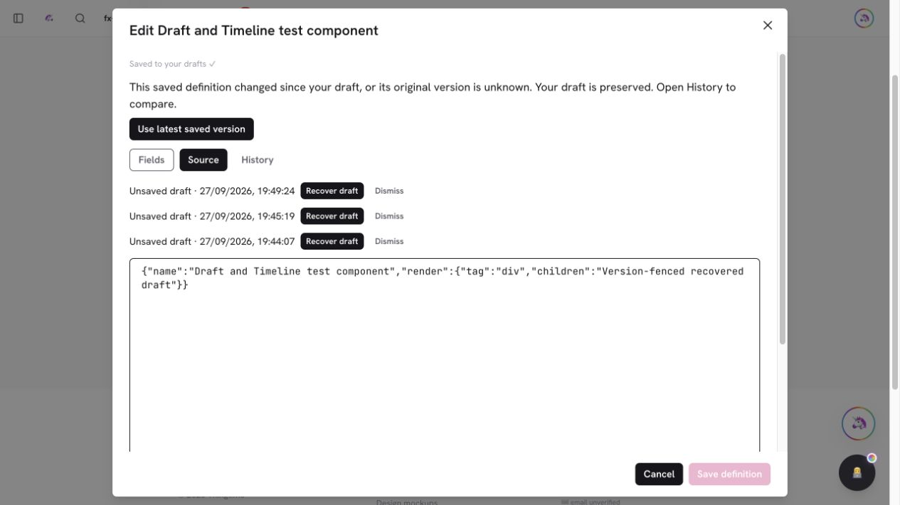

# PR #957 — Autosave account drafts and add reusable post templates

https://github.com/lopugit/thingtime/pull/957

## Result

Signed-in editing in posts, rich/plain comments, Things, definitions and schema
editors now preserves private account drafts. Changes receive an immediate device
recovery copy, followed by serialized background saves. The composer has a shared
searchable draft/template picker, and the post menu can save an existing post as a
reusable template. Loading a template creates a fresh working copy; publishing or
discarding that copy leaves the template intact.

## Persistence and security

- Protected owner-only `draft` Things use existing home-collection transactions,
  quota accounting, authentication and fail-closed rate limits. Generic CRUD/feed
  access excludes them. Snapshot JSON is bounded to 512 KiB and preserves raw,
  unfinished editing values.
- Revisions and immutable write identities prevent stale overwrites. Uncertain
  writes replay exactly before later content. Transient failures retry with
  backoff; conflicts offer a fresh draft with independent media copies.
- Templates copy through the canonical media service. Working draft media becomes
  durable and remains private; posting transfers binding in the normal post
  transaction. Discarded remaining files rejoin the existing expiry/reaper path.
- Posting records its frozen submission identity before the mutation. Successful
  publication retires the working draft; tombstones reject delayed resurrection.
  Local retirement markers retry cleanup after response loss.
- Device drafts, Thing workspaces and cross-tab channels are account/origin scoped.
  The legacy device workspace is retained and copied once to the first opening
  account, without automatically uploading it on hydration.

## Validation — 2026-09-27

Integrated current main's Timeline, ARIA and XPath changes before release. The
Definition editor retains both account recovery and Timeline recording. Browser
testing found that a recovered old definition could otherwise inherit the latest
server timestamp and overwrite newer content. Draft snapshots now retain their
original timestamp, stale/unknown bases cannot publish, and selecting the latest
saved version first preserves recovered text in History. Four regression tests
cover restore, stale-save rejection, server conflicts and backup failure.

Main's subsequent schema/upload release (`b96507b4e`, PR #954) is integrated too.
Schema forms keep native kind-aware publication and private visibility while
flushing account drafts first. Newly supported JSON fields store exact source
text in versioned drafts rather than serializing invalid-input sentinels as null.
Four additional tests cover unfinished/nested JSON, typed publication, legacy
drafts and array removal. Browser/API checks confirm unfinished text survives
reload, invalid JSON cannot publish, corrected JSON creates typed data and the
working draft retires. The real draft/media verifier passes against the new
attachment implementation, including independent copies after source deletion.

The complete pre-PR-954 run passed 4,094 tests with eight expected skips, and its
CI build/typecheck/unit and clean-database API jobs passed. The updated combined
revision is tested again locally and in CI; see the PR checks for that exact head.

- Full unit run after Timeline integration: 4,086 pass, eight expected skips,
  zero failures. The draft suite including the four new regression tests passes
  14/14. Initial missing `fake-indexeddb` was resolved through the existing
  worktree dependency setup before rerunning the full suite.
- Production build and Vercel output verification pass with the recovery fix.
- Full local real API suite: 901/902 pass. The sole failure,
  `webpages-demos-library-components`, finds a pre-existing partially seeded demo
  catalog (five of nine references resolve; four form components are absent).
  No draft endpoint failed, and the clean-database CI suite remains the release
  check for this environment-dependent catalog assertion.
- Browser/API checks additionally cover invalid definition JSON recovery,
  concurrent definition changes, History backup before selecting the current
  version, fresh editing/publication afterward, unfinished schema field recovery,
  schema publication/retirement, schema form reloads, and comment reload,
  publication and draft retirement.

- 223 focused draft, autosave, Thing-provider, feed and schema projection tests pass.
- Editor suite: 98 pass, one expected browser-only skip. Capability suite: 87 pass.
- Attachment suites passed, including authorized working-draft media transfer.
- Targeted lint: zero errors. Production build and Vercel output verifier pass.
- Local API tests exercised owner/stranger/anonymous access, partial fields,
  revisions, replay, retirement and reusable templates through real Mongo
  transactions. Media checks exercised uploads, publication, independent copies
  and reuse after deleting the source post.
- Browser checks covered post reload recovery, publication, menu template saving,
  template reuse, edited-copy publication and desktop/mobile picker layout.
- Final merged-base attachment/capability/draft checks: 162 pass. Extended real
  API checks also pass for conflict-copy recovery with media. The shared Thing
  editor loads an account draft, saves fresh typing to the account API, and
  retains that value after browser reload.
- Raw TypeScript checks on both the branch and main (`50863f13c`) each
  report 91 errors. Their normalized diagnostic sets are identical; this change
  adds no TypeScript errors. The tracked ratchet baseline remains unchanged.
- The PM2 daemon stopped responding to its list command, and the old local
  Nitro runner became unavailable. Final API/browser acceptance used the
  documented foreground validation stack on ports 18380/18381/18382. No global
  PM2 daemon or unrelated app was restarted.

## Setup and review

No new secrets or external services are required. Use existing authenticated
sessions, the transaction-capable home Mongo database, and the documented upload
storage/approval setup for media. See the [feature map](../docs/feature-map/account-drafts-and-templates.md),
[README](../README.md) and [manual checklist](../TESTING.md#account-drafts-and-reusable-post-templates).

The release PR targets `main`; CI and deployment status are tracked on the linked
PR. No new secrets or data migrations are required.

## Browser evidence

Desktop picker at 1265 CSS pixels, with a working draft and reusable template:

Narrow mobile layout (300 CSS pixels at the browser's existing zoom):

A recovered definition cannot overwrite a newer saved version:

