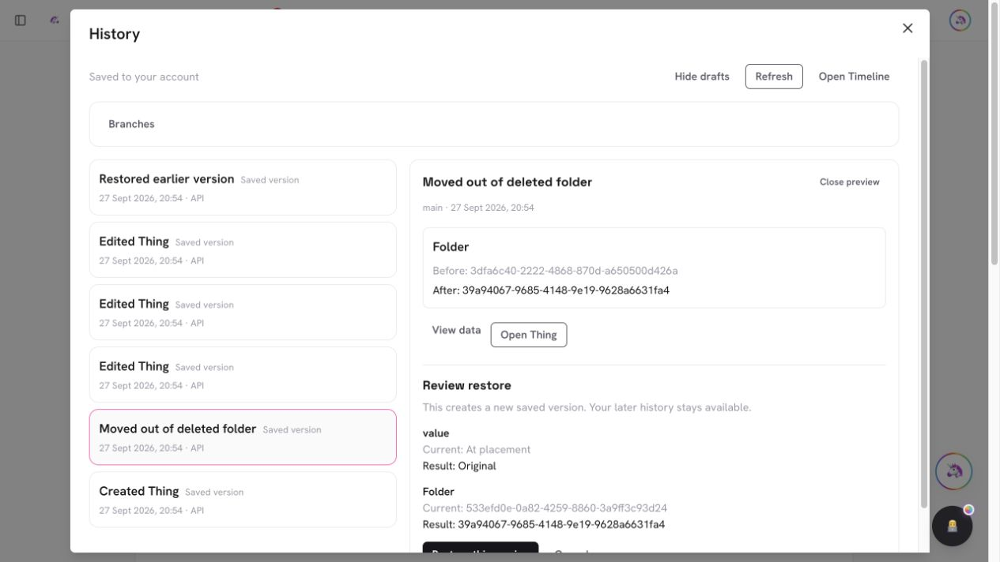
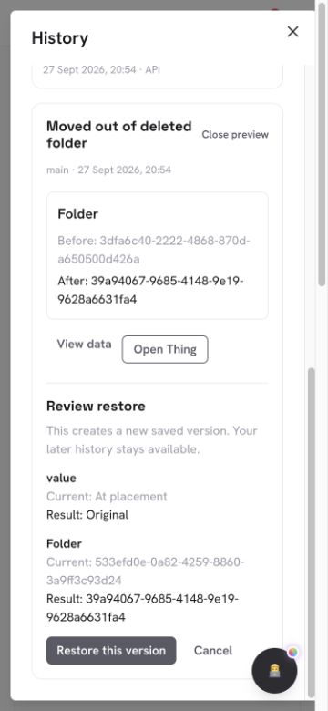
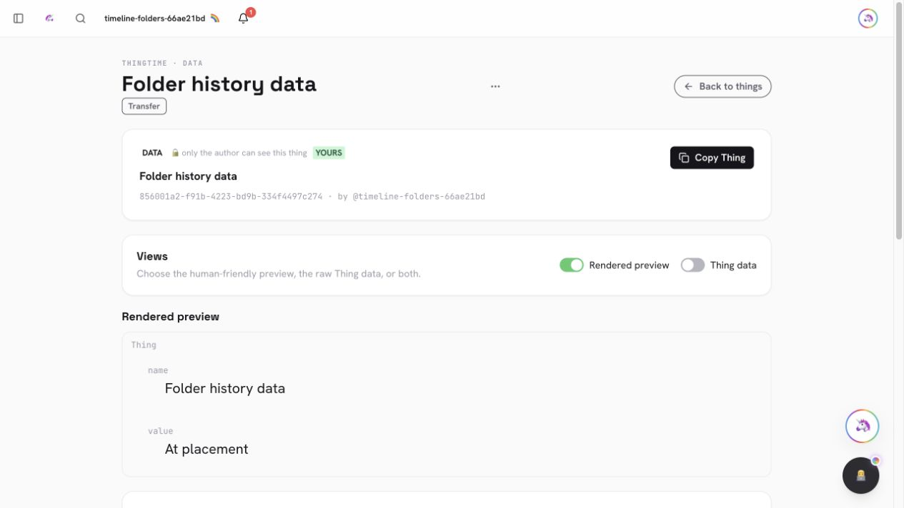

# PR #965 — Record folder moves and restore their exact Thing history

Deleting a folder previously removed its root before a raw child update: child moves had no history, and concurrent creates could retain a deleted folder id. Folder deletion now drains children in bounded transactions, recording each placement with the child write, before removing the root. One operation links the moves and final deletion; subfolder descendants stay nested. Partial drains retain the root and return an actionable retry.

Canonical, protected-library and archive placement share private ancestor write fences. These prevent deletion races and concurrent moves forming a cycle without manufacturing folder content edits. Ordinary moves retain compact placement snapshots after a complete saved baseline; restore/merge reconstructs that exact historical content. Protected library events contain only folder ids. Their dedicated content restoration remains future work.

History labels moves explicitly, and restore/merge refreshes the open Thing without a manual reload. Local and remote event/link schemas remain identical and relational. Timeline advertises 1.3.0; Things advertises the compatible 1.33.1 fix.

Validation:
- Full unit suite: 4,166 passing checks, no failures; focused Timeline 64, Things 292 + 18, and capability manifests 90.
- Disposable replica-set HTTP suites: folder create/delete races, four-folder cycle races, protected theme moves, retained subtrees, missing destination refusal, exact restore retries, and a 105-child deletion across batches with no duplicate move events. Four consecutive compact moves reconstruct the historical content and merge base.
- Live browser checks on desktop and 375px: review/apply restore, later history retained, and restored content refreshes in the open Thing. A transient local rebuild failure kept cached History visible and recovered on Refresh.
- Final Vite/Nitro/Vercel build and changed-file lint pass. Lint retains three existing warnings in things.ts. The warning-only typecheck comparison remains at 91 existing diagnostics against baseline 89; no clean typecheck claim or baseline change.
- Graphify structural snapshot refreshed and the new TypeScript modules are present. Its existing extractor omits .mts scripts, including the prior Timeline integration script; no .mts structural coverage or fresh Markdown semantic extraction is claimed.

This is a tested increment of the active Unified Timeline goal. Complete dedicated protected writers/outcomes, quota-ceiling acceptance, named-branch editing/merge, dependency reconstruction and the other items in docs/unified-timeline.md remain open. Targets main under the user's explicit authorization to merge tested increments as work proceeds.

## Browser evidence

The initial browser check exposed a pre-existing stale Thing view after restore.
The detail route now listens for the shared applied event, refetches the matching
Thing, and keeps its prior projection during that read. Repeating restoration
changed the rendered value immediately without a navigation or manual reload.

The browser and HTTP fixtures use synthetic accounts in the disposable
`timeline-rs` replica set at `127.0.0.1:20337`. No authenticated production
mutation was performed. Both opt-in folder scripts refuse another database.
The 105-child test uses supported bulk-copy API requests within normal quotas.

## Implementation boundaries

- The baseline is main merge `7072ae660c48dae46433942eb6481c8dd38aeda1`
  (Action/AI provenance PR #959), with account draft recovery preserved.
- Each drain transaction reads one child and its exact physical root, fences
  root and destination ancestors, commits a child CAS plus history, and leaves
  descendants in their existing subfolder. The final root transaction checks
  that direct children and target-attached records are empty before deletion.
- The delete's original timestamp fences concurrent root renames/moves. Its
  private ancestor tokens never change content timestamps or produce fake edits.
  A maximum of eight 100-item passes bounds one call; unfinished work returns
  409 with its root present. Retrying continues from remaining children.
- Compact moves retain a full initial baseline for legacy Things. A historical
  content edit after a move cannot change the restored version's content.
  Strict placement snapshots reject unknown fields and malformed folder ids;
  server metadata is unmetered, while client-authored payloads remain metered.
- Protected attachment/theme/algorithm/emoji/archive moves use only the managed
  placement adapter. Unexpected protected kinds refuse with an actionable 409.
  Generic restoration remains unavailable for protected content.
- Existing quota/typecheck baselines are unchanged. Live quota-ceiling and
  downgrade tests, full dedicated writer coverage, complete Action outcomes,
  dependency versions and named-branch editing/merging remain in the active goal.

The full unit run preceded the small Thing-route refresh correction; that final
correction was checked in the live browser, by route lint, typecheck comparison
and the final production build. Required remote checks must pass for the final
exact PR head before a normal merge commit.

## Main integration

Integrated main `c36d20782` after the native Web Standards traversal work
(PR #962) landed. Its bounded synchronous callbacks and Actions 1.35.0 contract
are preserved alongside Timeline 1.3.0 and Things 1.33.1. The folder mutation
implementation is unchanged. Final required CI runs against this combined head;
prior green checks do not satisfy that gate.
