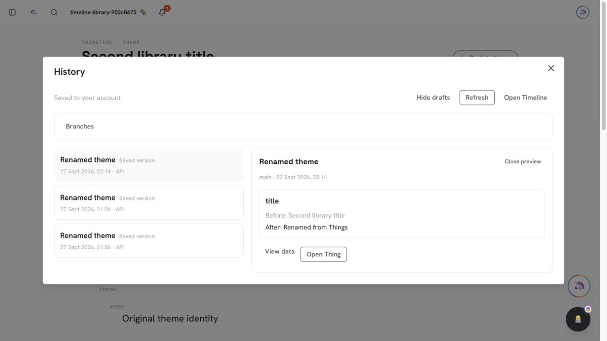
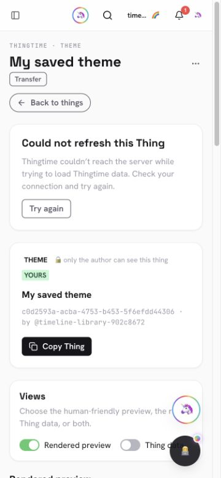

# PR #966 — Record library renames in shared History and refresh Thing views

The Things display-title writer now records theme, feed algorithm, custom emoji
and chat-archive renames transactionally. Every event uses the shared, strict
`library-title` v1 snapshot with only `{title: string | null}`. It preserves the
original source name and protected payload, retains the previous saved head, and
inherits trusted server Action/AI provenance. Titles count toward history
storage; unchanged titles add no content event. A recording/head failure rolls
back the title and its storage delta together.

The live browser checks exposed two related view problems. A successful menu
rename left the permalink title stale, and a subsequent transient read failure
cleared the cached Thing. The permalink now updates its matching projection,
refetches, and retains content during transient failures with Try again. Access,
missing-record and identity refusals clear the view and its cache. Diagnostics
remain live-only. The shared optimistic rename helper also preserves managed
source names and attachment names, matching their dedicated writers.

## Validation

- Main baseline is normal merge `f46b7400b1ba7023a6f5fad0bfd135af1eb3f908`
  (folder-history PR #965). Timeline 1.4.0 and Things 1.33.2 preserve its contracts.
- Full unit suite: 4,185 passing checks, zero failures (8 existing skips).
  Focused Timeline 66, Things 295 + 18, and capability manifest 91 tests pass. They cover
  four library kinds, title-only projections, trusted provenance, history
  metering, no-op suppression, transactional failure and read-retention policy.
- Real HTTP tests use a fresh synthetic account in the disposable `timeline-rs`
  replica set at `127.0.0.1:20337`. They verify stale/forged-input refusals,
  exact parent chains, independent API operation ids, unchanged-title behavior,
  current-head projection and preserved original theme identity. The opt-in
  `test:timeline:library` refuses any other database.
- Browser: rename through Things, inspect exact before/after titles in History,
  repeat rename, and verify the heading updates immediately without navigation.
  The original theme name remains unchanged before and after reload.
- Browser network tests: block only the disposable Thing API read, reload its
  cache, then restore networking and use Try again. Content remains visible.
  Inject an explicit 403; the view clears, and a subsequent blocked-read reload
  cannot recover the evicted content. Restore the actual response and retry.
  All interception and viewport overrides were removed afterward.
- The temporary-failure view is reachable at desktop and requested 375px width
  (the browser reported equal client/scroll widths of 360px), with no horizontal
  overflow. Screenshots below show the retained content and retry control.
- Final Vite/Nitro/Vercel production build and route lint pass, including the
  cache-eviction and callback correction. The first CI run found the existing
  stable-onChanged regression check; the refresh callback now has a stable
  identity, and the full local suite above passes. Required remote CI still
  validates the final exact head. Changed-file lint has zero
  errors and one existing import-type warning in thingsCore.ts.
- Typecheck comparison remains at 91 diagnostics versus baseline 89, with no
  new changed-file diagnostic. This is not a clean typecheck claim; the baseline
  is unchanged.
- Graphify structural outputs are regenerated for the final source. The current
  extractor omits .mts scripts; no .mts or fresh Markdown semantic coverage is
  claimed.

## Scope remaining

This is one increment of the active [Unified Timeline goal](../docs/unified-timeline.md).
It does not add generic protected-content restore or claim coverage for all
protected creation/payload/deletion writers. Full Action outcomes, quota-ceiling
acceptance, rich-text/unsaved capture, named-branch editing and merges, historical
dependencies, deleted-Thing recovery, and large streamed restore remain open.
No authenticated production fixture mutation was performed.
