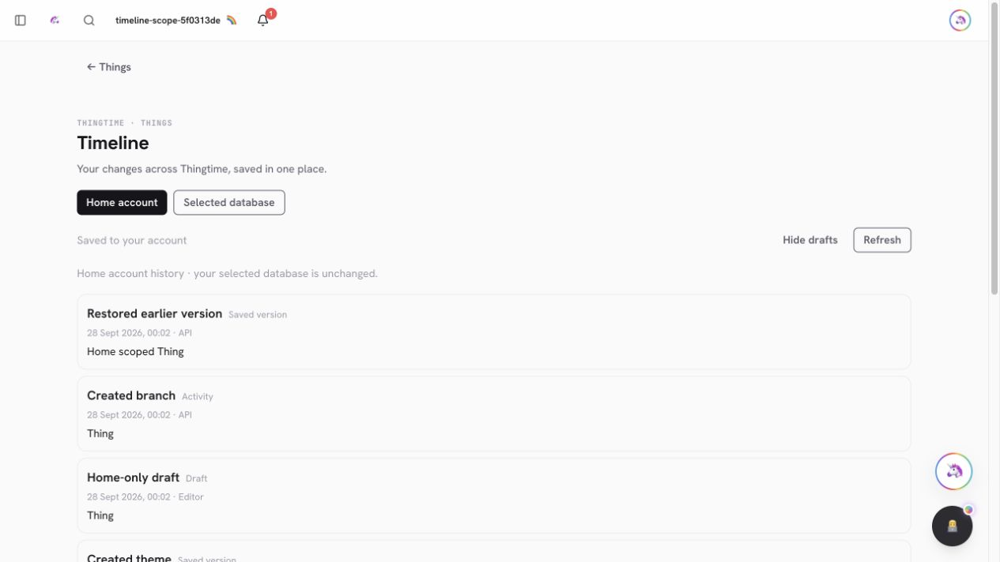
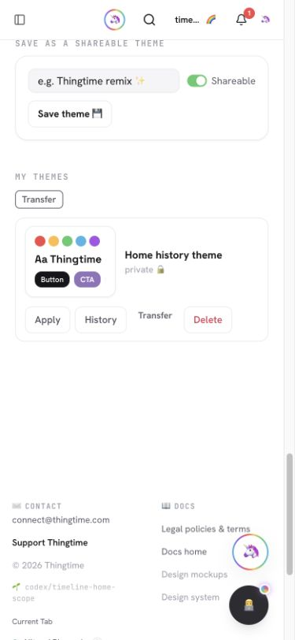
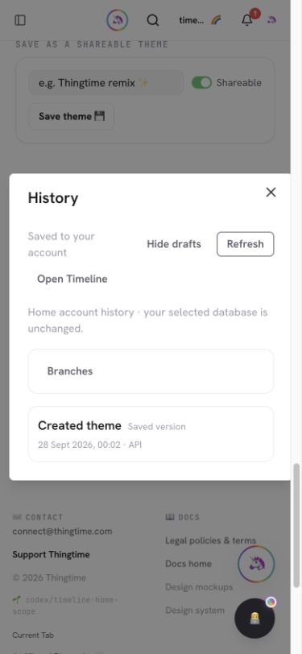

# PR #971 — Keep home History accessible across database selections

Selecting a custom database previously redirected the shared History view away
from saved themes and other home-owned library Things. Saved themes now expose
History directly, and the Timeline folder offers Home account and Selected
database views without changing the application's selected endpoint.

## Implementation

- Timeline 1.6.0 adds explicit `storage=home` on the existing endpoint. The
  request-local home context covers discovery, paging, exact versions, draft
  uploads, branches and version preview/apply. Owner and expected data-plane
  checks still run; a stale custom request never silently changes location.
  Selecting the exact home URI reports home, matching collection routing.
- The provider holds home and selected sessions using the same canonical
  relational event/link/branch schemas and origin/owner/data-plane cache keys.
  Reference-counted connection leases share a single in-flight upload queue
  when both sessions resolve to home. Different databases remain independent.
- Private cached history survives network failure. An explicit account access
  refusal clears both active sessions' downloaded cache while preserving
  authored pending edits. Cached discovery cannot upload before revalidation.
- Known home-owned library kinds open the home panel; ordinary Things and
  Builder use the selected database. The entire panel, including branches and
  restore, uses its chosen session. Open Timeline preserves that location and
  dismisses the modal on navigation.

## Validation

- Guarded real HTTP acceptance on two disposable databases: matching event and
  Thing IDs with distinct payloads, home theme privacy, exact reads, home
  branch creation and ordinary-Thing restore under a custom selection,
  wrong-owner/stale-plane refusals, anonymous access and concurrent isolation.
- 74 Timeline tests and 92 capability tests passed. Complete unit suite:
  4,218 passed, eight skipped. Production Vite/Nitro build and Vercel output
  verification passed. Targeted source/script lint: zero errors (ten existing
  source warnings). Raw typecheck: the existing 91 diagnostics, none in the
  changed/new modules; this is not a clean typecheck claim.
- Desktop and 390px browser acceptance: saved-theme History opens home while
  custom remains selected; Open Timeline dismisses the modal; location toggles
  show only that database's matching-ID events. Blocked Timeline requests and
  reload preserve independent cached pages. Simulated 403 responses remove both
  visible caches; removing the refusal restores remote history. The mobile
  button row and Timeline page have no horizontal overflow (375px client and
  scroll widths with the scrollbar). Network/viewport test overrides and the
  synthetic browser's custom selection were reset afterward.
- README records the fork-safe disposable acceptance command; TESTING contains
  the new scope, offline, revocation and navigation regression checklist.

## Remaining scope

Cross-source Open Thing navigation is disabled with a clear explanation until
home Thing navigation can preserve the same source explicitly. Dedicated theme
restore/merge, active-theme selection, legacy themes, other protected writers,
named-branch editing and the wider operation-coverage ledger remain open in
`docs/unified-timeline.md`. This increment adds no new event schema, collection,
index, credentials or runtime configuration.
