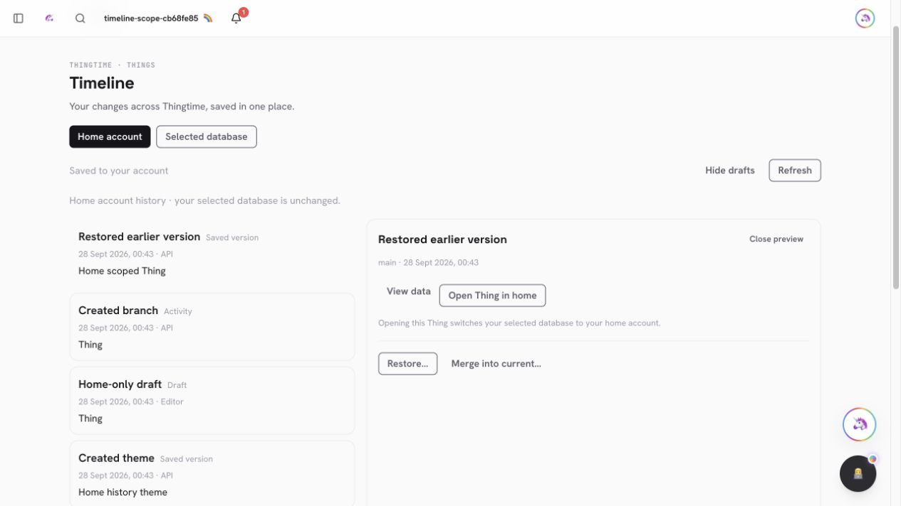
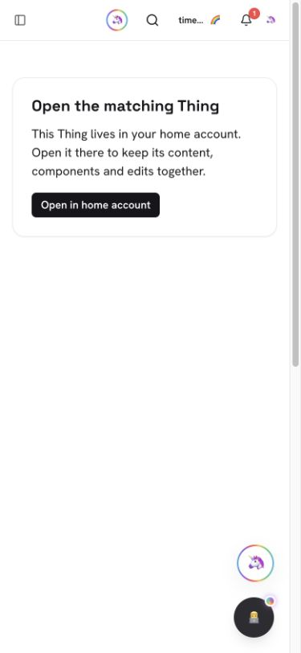
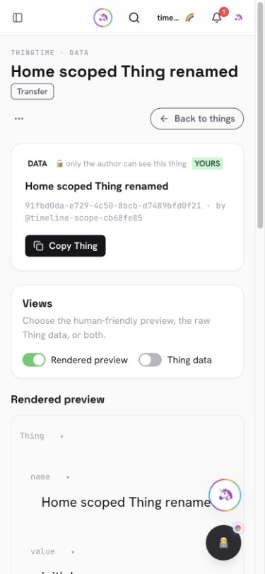
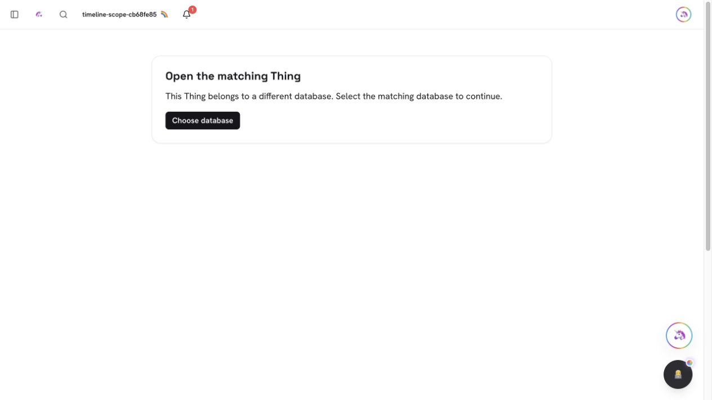

# PR #972 — Open history Things in their matching database

Branch: `codex/timeline-thing-navigation`, based on main's PR #971 merge
`917c272cf459fefe3e7541b00ff50b37f65c5827`.

## Behavior

Home history under a custom database selection previously disabled Open Thing.
An ordinary permalink cache also lacked database identity, so matching Thing
ids could reuse the wrong source's projection. History now labels the explicit
handoff **Open Thing in home**, explains that it changes the selection, invokes
the existing endpoint reset, and opens an account/database-qualified link.
Mismatched links show recovery before mounting the Thing view. Thing caches
include their database and do not seed from ambiguous legacy entries.

Root data, Timeline and the server guard use one canonical public database key.
No event/link/branch/outbox schema, canonical scope key, Mongo collection or
credential format changes. `api.mongodb-endpoint` 1.1.0 negotiates the optional
`X-Thingtime-Expected-Data-Plane` precondition. It refuses malformed keys with
400 or a changed selection with 409 before the handler. It checks the actual
selected source before explicit-home/admin routing, never grants access or
selects a source, and cannot use the fallback proxy. Endpoint reset/deletion
remain available for recovery.

Shared fetcher mutations, Thing reads and Timeline discovery capture source
identity before capability awaits. Existing root identity invalidation covers
database changes across tabs. Selected Timeline cached discovery must match
root identity. The existing home-only comments projection shows a clear notice
on custom Thing pages.

## Validation — 2026-09-28

- Full production build and Vercel output verification passed.
- Full unit suite: 4,224 pass, 8 skip, 0 fail. After final discovery/cache and
  copy/layout adjustments: 74 Timeline and 35 root-data tests passed.
- Focused suites: 315 Things, 60 collection and 92 capability tests passed.
- Changed-source and integration-script ESLint: zero errors/warnings beyond
  the existing Remix-config deprecation notice.
- Raw TypeScript: 91 existing diagnostics, none in changed/new modules.
- The secret scanner flagged the initial reserved `.test` Mongo URI fixtures.
  Those were synthetic values, never real credentials. The final tests generate
  their credentials at runtime while preserving the same identity/privacy
  assertions; no account credential was exposed or needs rotation.
- Root-data privacy compares its returned identity with a credential-free
  location, so including even a hash of the credential fails the assertion.
  CodeQL's earlier path originated in the test's expected-value calculation;
  this independent reference strengthens the test without changing production
  hashing, scope identities, scanner configuration or alert policy.
- `test:timeline:home-scope` passed against the guarded disposable loopback
  replica. It creates matching live Thing ids in two databases, verifies exact
  Timeline/root identity, stale GET/PATCH/DELETE refusals with unchanged content
  and events, malformed keys, and selected-source checks before home routing.
  Accepted custom edits change only custom content and its history.
- In-app Browser: two tabs, both databases' same-id Things, blocked Thing reads,
  cross-tab selection changes, retry and cached reload. An uncached database
  never displayed the previous database's content; a matching cache remained
  available during a temporary failure.
- Home History handoff opened the correct home Thing. Switching away in another
  tab made its pinned link show recovery; returning home recovered the view.
  Wrong-account and custom-source pinned links showed only their recovery UI.
- A normal UI rename after the home handoff changed home content/history;
  independent authenticated API reads confirmed custom content/history stayed
  unchanged. No production account fixtures were mutated.
- Desktop guard centered at x=272.5, width=720 in a 1265px viewport. The 390px
  mobile viewport had client/scroll width 375/375, with reachable recovery and
  Thing controls. Network/viewport overrides were removed, home selected, test
  tabs closed, and the private synthetic credential fixture removed.

## Scope still open

This increment does not make every application cache database-qualified and
does not require legacy external callers to send the optional precondition.
Dedicated managed-family coverage, theme restore/merge, rich-text drafts,
branch checkout/edit/merge, deleted-Thing recovery, large streamed restoration,
retention controls and complete Action/AI outcomes remain in the
[universal Timeline ledger](../docs/unified-timeline.md).

Required CI, exact-head merge and production deployment are verified externally
after the final source/graph commit; local acceptance is not a production claim.
