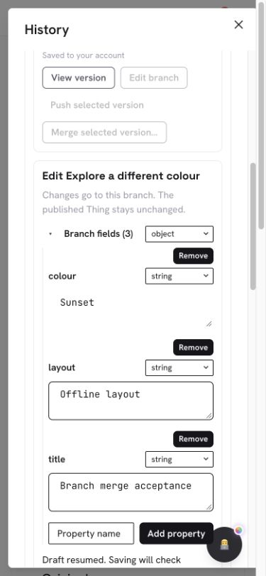
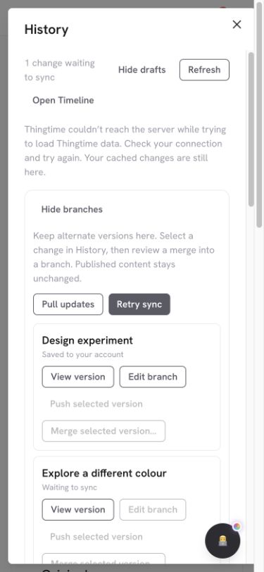
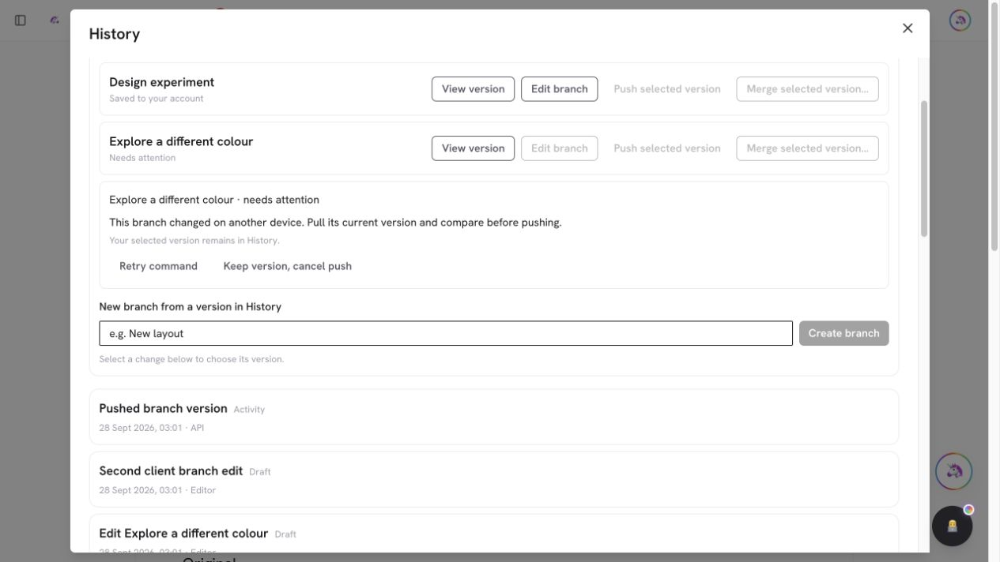

# PR #975 — Edit named Timeline branches with durable offline drafts

PR: https://github.com/lopugit/thingtime/pull/975
Branch: `codex/timeline-branch-checkout`, based on main after PR #974.

## Behavior and implementation

History → Branches → **Edit branch** opens the exact version in the existing
`DefinitionValueEditor`. It edits crystal fields using full canonical
`thing-content` drafts. `TimelineDraftRecorder` persists edits locally before
Save can enqueue the existing `advance-branch` command. Published Things remain
unchanged. A concurrent/stale push preserves the edit for explicit merge.

`api.timeline` 1.8.0 adds `checkout-branch` on the registered route with the same
private/full-account/source fences. Branch/head/revision and original event
identity are checked. The shared historical materializer resolves compact drafts
and folder ancestry; it never borrows the current published Thing. The original
entry remains canonical and immutable, alongside a transient editable projection.
Replies are capped at 4 MiB. No persistent schema, collection, index, IndexedDB
version or configuration changes are needed.

Cached canonical revisions carry kind/target metadata that the six editable
fields do not. Checkout projects those fields without rewriting the event.
The browser regression caught and corrected an initially over-strict cache shape
check. Mobile branch names also needed their own full row after adding the editor
control. Both fixes have focused/browser coverage.

Account/source/head identity remounts the editor. Refresh never replaces fields
edited from cache. Draft pins survive reload and remain explicitly recoverable;
confirmed pushes release only the saved pin, including after retry/reload. Newer
and rejected drafts keep theirs. Correcting an oversized capture clears that
capture's failure; an uncorrected failure still refuses a successful flush.

## Validation

- Timeline: 92 tests pass, including strict checkout transport, canonical cache
  projection, folder/draft reconstruction, stale/foreign refusal, pin lifecycle,
  lost acknowledgment, newer edit protection and corrected capture failure.
- Capabilities: 92 tests pass; both published manifests report Timeline 1.8.0.
- Real disposable local replica-set HTTP: existing named-branch integration now
  checks exact checkout, field edits, idempotent retries, stale checkout,
  divergent resume refusal and unchanged published content.
- Desktop and 390px browser: edit two fields; block Timeline requests; reload
  before Save; explicitly resume; queue Save offline; reload again; reconnect
  and Retry sync. Exact API readback: branch revision 2, colour `Sunset`, layout
  `Offline layout`; published colour/layout both `Original`.
- Concurrent browser acceptance: keep a `Local Amber` edit open while a separate
  HTTP client advances to `Remote Blue`; Save refuses the stale revision and
  retains the local draft with “Keep version, cancel push” controls.
- Mobile measurement: document client/scroll width both 375px, History dialog
  347.7px at a 390px viewport; fields and controls stay inside the dialog.
- Full build and unit suite are run on final source before merge. TypeScript
  matches the existing 91-diagnostic baseline with none in changed modules;
  targeted lint has no errors and two pre-existing route warnings.
- Final Graphify AST/manifest pair is refreshed before merge. Existing `.mts`
  integration scripts are not indexed by that detector; the HTTP script is
  directly executed. Markdown semantic freshness is not claimed.

Browser network and viewport overrides are reset after acceptance. All test
writes are confined to the explicitly disposable local replica set; production
verification is read-only.

## Screenshots

## Remaining scope

This is branch field editing. Visual Builder checkout, rich text source editing,
exact historical dependency rendering, remaining managed/protected writers,
deleted Thing recovery, streamed large-version operations and broader end-to-end
Timeline acceptance remain in the active goal.
