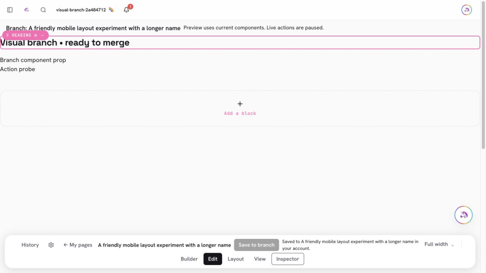
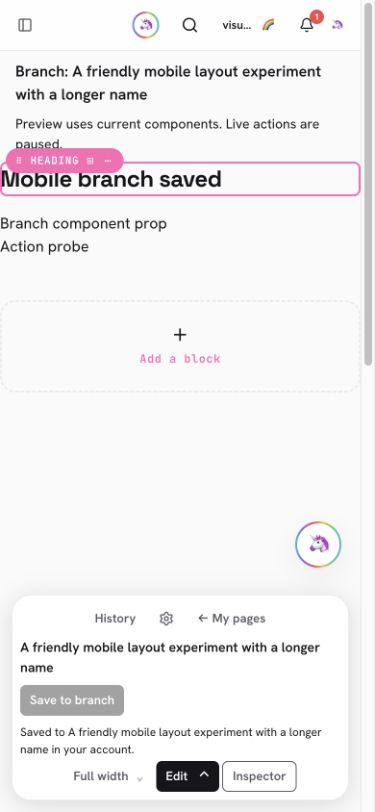
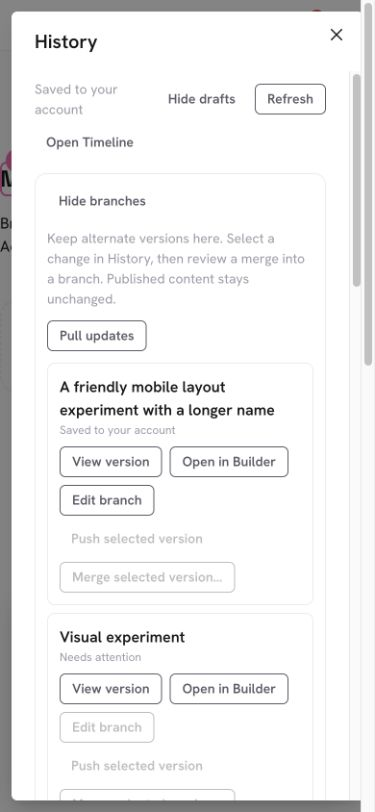

# PR #977 — Edit named Timeline branches in the visual Builder

PR: https://github.com/lopugit/thingtime/pull/977
Branch: `codex/timeline-visual-branches`, based on main after PR #976.

## Behavior and boundaries

History → Branches → **Open in Builder** opens a named page version in the
ordinary visual canvas and inspector. Text, component-instance props, layout,
name and audience edits use the canonical full content snapshot and existing
Timeline recorder, relational event/link records and branch-command outbox.
There is no schema migration, collection, index or extra runtime setup.
The shared working-copy model also powers the existing field editor.

Successful saves adopt the acknowledged branch revision for another edit.
Offline/uncertain pushes retain their immutable operation and lock editing;
stale pushes preserve the local version for a reviewed merge. A reloaded queued
push is reviewed/synced in History and explicitly reopened. Discard serializes
with edits and saves. Cached checkouts render immediately once available;
a remote refresh cannot replace local edits. StrictMode cleanup permits the
replacement load. Toolbar and inspector saves flush active inline text first,
and pointer focus stays stable so blur cannot move Save before its click.

Branch routes require the original account and database. Ordinary published
writers and AI save registration are not mounted. Preview uses current visible
components, fetched in one batch through private POST webpages-resolve 1.5.0.
The request supplies only bounded blocks and exact account/source scope; it
cannot borrow a stored page's inherited audience. Current preview responses
have a four-entry, 256-KiB-per-response cache qualified by owner/origin/source/
branch/Thing. Durable history formats remain identical locally and remotely.

Live Actions, page source runtimes, native sections and suite installation are
paused, including authored `mode=run` URLs. Publish/Visit/transfer controls are
hidden or disabled. Exact historical dependencies, branch-aware AI editing,
remaining protected adapters and the broader Timeline acceptance ledger remain
open. This PR does not claim the entire universal-history goal is complete.

## Validation

- 102 Timeline tests; 144 webpage tests passed with 3 existing skips; 92
  capability tests. New tests cover canonical working-copy saves, immutable
  offline/lost-reply retries, stale retention, recovery identity, discard races,
  block projection/metadata and private batched component resolution.
- Full unit suite: 4,257 passed, 8 existing skips. Full production build passed.
- Raw TypeScript: 91 pre-existing diagnostics, identical normalized messages
  and occurrence counts to main. No introduced diagnostics. Targeted TS/TSX
  lint: no errors, 7 existing warnings. The existing ESLint parser rejects
  TypeScript in `.mts`; this opt-in integration was executed directly instead.
- Guarded disposable HTTP (`127.0.0.1:20337`, `timeline-rs`): viewer-only
  component resolution, guessed foreign private refs, malformed scope, and
  unchanged published content. No production writes.
- In-app browser, desktop and 390px: text, component prop and page metadata
  saves; first inline-edit Save without prior blur; successive branch revisions;
  offline reload, explicit draft recovery, queued push reload and reconnect;
  field-editor save; concurrent remote push retaining a refused local edit;
  long branch names and wrapping controls; inert Action in View/run URL;
  wrong account/source and signed-out cache redaction; ordinary published
  Builder still shows its original heading/component.
- Exact server readbacks: original branch reached revision 4 after one offline
  replay, 5 after the field edit, and remote 6 after the competing push. Its
  refused local version remained in History. A second visual branch reached
  revision 4 with the final inline heading, page name and component prop. The
  published page crystal was equal to its original fixture throughout.
- At 390px the toolbar measured x=12, right=363, bottom=832 in an 844px height;
  document scroll width was 375, without horizontal overflow. Branch names and
  Open in Builder controls wrap normally in the History modal.
- TESTING.md, README, capability/Things/sharing feature maps and the Timeline
  contract updated. Graphify AST/manifest pair refreshed before merge; Markdown
  semantic freshness is not claimed. `.mts` integration runs are direct evidence.

CI/security gates and exact deployed commits are checked before reporting live.

## Browser evidence

