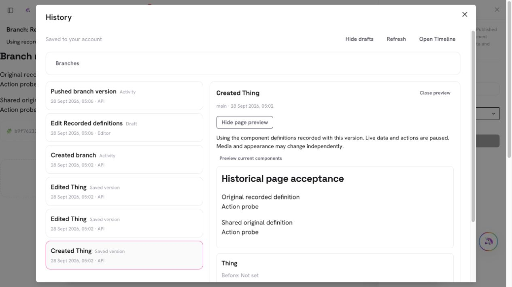
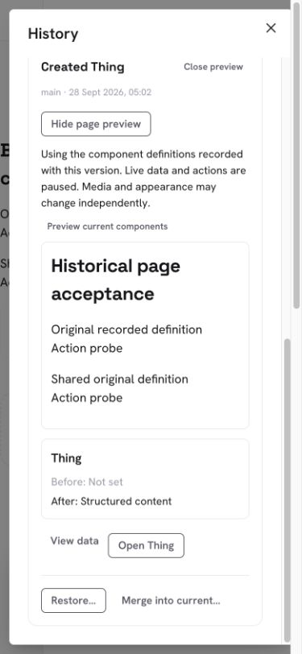
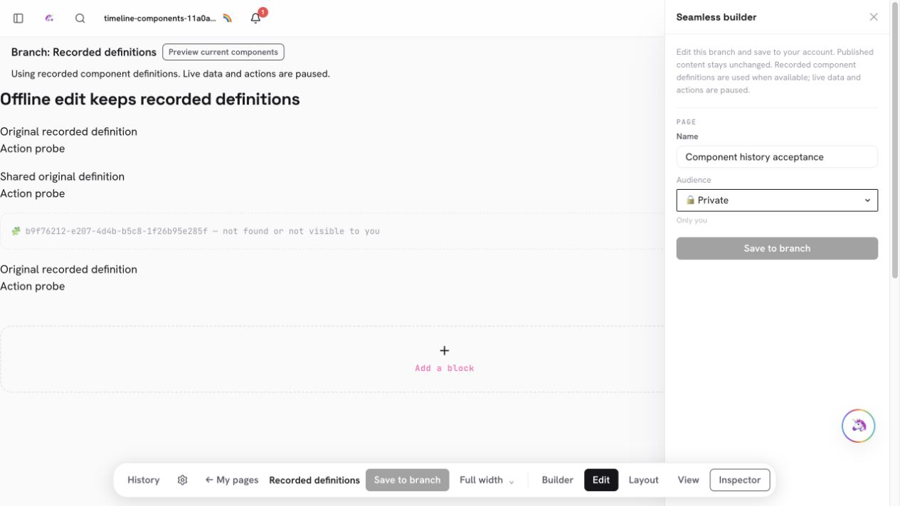

# PR #978 — Preserve recorded component definitions in Timeline page versions

PR: https://github.com/lopugit/thingtime/pull/978
Branch: `codex/timeline-component-snapshots`, based on main after PR #977.

## Behavior and data model

History → select a page version → **Preview page** renders the recorded blocks
and component definitions. Named visual branches use the same captures by
default; **Preview current components** explicitly switches to today's visible
definitions. Subsequent edits record what is shown. Adding another instance of
an already recorded reference keeps its existing definition. Actions and live
data remain paused; historical links cannot execute actions or navigate away.

Each authored reference has an immutable `component-binding` capture event,
linked through existing atomic Timeline dependency relations. Snapshots whitelist
`id` and `crystal`; authors, ACL/grants, link keys and database envelope fields
are omitted. One dependency can serve multiple page versions. There is no new
collection, growing history array or local-only durable format. Captures use the
same canonical records and private Timeline folder locally and remotely.

Server page writes capture currently authorized definitions in the page mutation
transaction and reuse unchanged captures. Client drafts capture displayed
versions and queue dependencies first. An explicit null records an unavailable
reference; a missing link means the definition was never recorded. Earlier
versions never silently substitute today's components. Previously readable shared
content remains a private point-in-time copy after source edits or revocation;
new server captures reevaluate current access.

The existing Timeline endpoint gains a strict, private component-read selector
under `api.timeline` 1.10.0. Owner/source fences precede reads. Queries batch a
bounded dependency set, preflight recorded byte sizes before payload decoding,
and cap responses at 4 MiB. The normal bounded canonical client cache fetches
missing captures on demand. Offline viewing requires those captures to be cached;
it does not download the account's complete history. No extra environment setup,
physical collection, schema migration or index is required.

## Limits

Direct component render definitions are covered. Nested Schema/Action/theme/media
graphs, historical binary bytes, runtime outcomes and dependency-aware restore or
merge remain open. Page-content restore/merge does not rewrite component Things;
a new server page commit resolves current definitions. Legacy missing captures
stay visibly incomplete. Above-limit pages do not get an unbounded alternate path.
This is one increment of the universal-history goal, not a completion claim.

## Validation

- Full unit suite: **4,268 passed, 8 existing skips**. Focused final checks:
  112 Timeline tests; 145 webpage tests passed with 3 existing skips; 92 API
  capability tests. New coverage includes projections, immutable split/join
  records, IndexedDB reload/eviction/retry and scope isolation, dependency-first
  uploads, branch retention/discard/no-op changes, prototype-shaped references,
  private endpoint selectors and metadata-first response budgets.
- Full production build passed after the final insertion fix. TypeScript has
  91 pre-existing diagnostics with identical normalized messages and occurrence
  counts to main. Targeted TS/TSX lint: zero errors, 8 existing warnings. The
  existing ESLint configuration cannot parse TypeScript in `.mts`; the guarded
  integration script was executed directly and passed.
- Disposable HTTP only (`127.0.0.1:20337`, replica set `timeline-rs`): atomic
  API captures, owner-local keys, public shared capture, guessed private refusal,
  unchanged-definition reuse, old captures surviving edits/revocation, new
  captures reevaluating permissions, and strict source/account/input fences.
- In-app browser desktop/390px: original/shared definitions in History and
  named branches; explicit current-definition toggle; legacy missing-definition
  notice; one preview after refresh/polling; no action-run request from an Action
  probe; inspector does not cover the toggle; mobile wrapping without horizontal
  overflow. Desktop/mobile screenshots are below.
- Offline API blocking + reload preserved recorded definitions. An offline edit
  survived another reload, then reconnected to branch revision 3. Insertion of
  another recorded component instance saved revision 4 and survived reload.
  Server readback confirmed original definitions and unchanged published heading.
  Wrong-account, invalid database link and signed-out routes exposed no private
  branch content. Generated fixture credentials were removed after sign-out.
- TESTING.md, README, feature maps, Timeline contract and changelog updated.
  Graphify AST/manifest pair refreshed before merge. Markdown semantic freshness
  is not claimed; `.mts` integrations are validated directly.

Exact-head CI/security and exact-merge production readiness/read-only probes are
verified before reporting live. No production content writes are part of QA.

## Browser evidence

