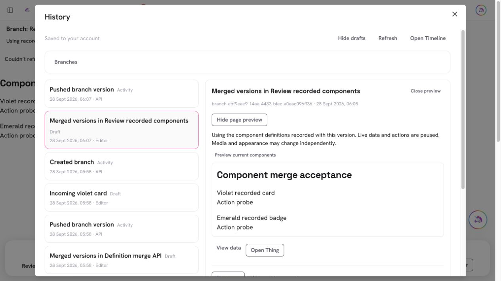
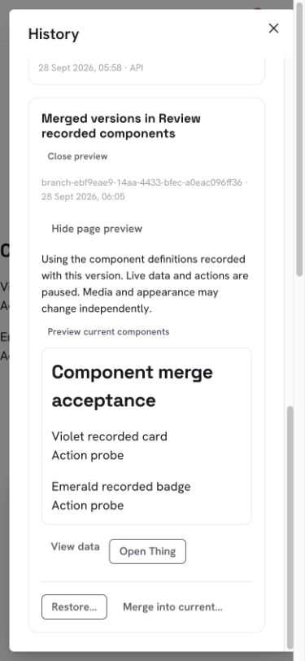

# PR #979 — Preserve recorded components when merging Timeline branches

PR: https://github.com/lopugit/thingtime/pull/979
Branch: `codex/timeline-component-merge`, based on main after PR #978.

## Behavior and contracts

Named-branch merges previously dropped retained component definitions. The
review now combines independent direct component changes and requires an explicit
Current / This version choice when definitions overlap. Identical definitions
with different capture IDs agree. Missing history stays missing; a captured
unavailable definition is a distinct known value. Removed refs drop their links,
new refs use the referencing side, and folder-only ancestry inherits the nearest
content revision's captures. Page conflicts are resolved before component choices.

Current, incoming and resolved page previews share an inert canvas: Actions,
navigation, form submission and live data runtimes stay paused. Saving caches the
selected canonical records before queuing the existing two-parent merge event
and revision-fenced branch command. Retry uses the original immutable identities.
Neither the published page nor component Things are rewritten.

The local and remote use identical atomic event/link schemas and the private
Timeline folder. Comparison maps are bounded transport, never stored history
arrays. `api.timeline` 1.11.0 adds optional `componentChoices` to the existing
comparison command. Old clients refuse versions with retained dependencies.
Unknown dependency families refuse explicitly. The reader validates exact
owner/event/Thing links, preflights scalar byte metadata before payload decoding,
and reads at most 360 unique captures in batches of 128. Aggregate response
bounds are 4 MiB and 200,000 nodes. No new endpoint, collection, migration, index,
credential or private configuration is needed.

## Validation

- Full unit suite: 4,274 passed, 8 existing skips. The subsequently added
  aggregate structural-budget regression is included in the final focused
  Timeline suite: 119 passed. Full unit includes 145 passing webpage tests
  (3 skips) and 92 capability tests. Targeted lint: zero errors/warnings.
- Full production build passed. TypeScript has the same 91 normalized diagnostics
  and occurrence counts as main; no new diagnostics. Existing lint tooling does
  not parse `.mts` TypeScript; the guarded integration script executes directly.
- Shared merge tests cover independent/overlapping/equal definitions, unknown
  history versus captured null, new/removed refs, stale choices, prototype-shaped
  keys, substituted/foreign/duplicate records, canonical split/join, IndexedDB
  reload, dependency retention, branch lost-reply idempotency and scope isolation.
- Guarded HTTP on `127.0.0.1:20337` / `timeline-rs` passed: actual definitions,
  exact canonical upload/retry, explicit conflicts, stale-head refusal, old-client
  refusal, later live component edits, unchanged published content, and account,
  source and anonymous fences. No production mutations used for QA.
- In-app browser: Current/This version/Result previews, explicit conflict choice,
  zero Action-run requests from preview clicks, desktop and 390px. Fixed long
  version labels overlapping Close preview; controls wrap with no horizontal
  overflow. Offline Save survived reload with the chosen violet card and emerald
  badge. Reconnect advanced the branch exactly once to revision 2; server reads
  confirmed both definitions and unchanged published crystal. Sign-out removed
  private previews; fixture credentials were removed and viewport/network reset.
- README, TESTING, Timeline contract and feature maps updated. Final Graphify
  AST/manifest snapshot is refreshed before merge; semantic Markdown freshness
  is not claimed. Exact-head CI/security and exact-merge production read-only
  probes are checked before reporting live.

## Remaining scope

Dependency-aware published restore/merge, nested Schema/Action/theme/media
versions, generic folder-version preview inheritance, streamed over-limit
comparisons and the broader Timeline acceptance ledger remain open.

## Browser evidence

