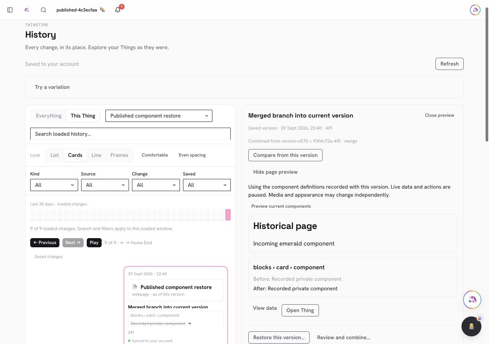
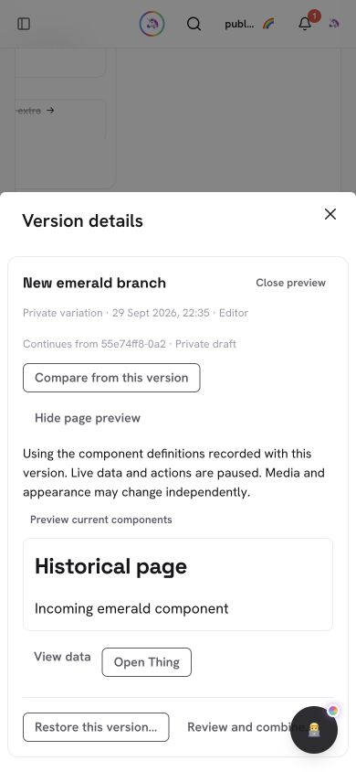

# PR #983 — Bring Timeline designs to life and restore recorded components

Date: 2026-09-29. Branch: `codex/timeline-published-components`, based on
`main` at `fa2ac2596328ef4289df6f231d9f945b8a4e1cc8`.
[Pull request](https://github.com/lopugit/thingtime/pull/983).

## User-visible change

History is discoverable in Things navigation and at `/history`. The Timeline
folder and contextual Thing History share the same Scope/Look browser.
List, Cards, Line and Frames project the existing event stream with historical
titles, property chips, real save receipts, a density strip, minimap, playback,
keyboard navigation, desktop details and a mobile sheet. Filters respond
immediately and persist in the global route URL. Comparisons are read-only;
variation commands retain the existing durable branch queue.

The design comes from Fable 5.1's PR #947 at
`71df35a634807ca583c37219b7118df3bd2b32a5`.
[Implemented concepts and remaining work](../docs/timeline-design-integration.md).

## Recorded component restoration

Restoring a page previously restored its block tree while rendering today's
shared definitions. The preview now offers recorded or current components.
Recorded mode creates fresh private Component Things and rewrites only the
restored page's references. Copies, storage accounting, page revision and
canonical Timeline records commit atomically. Other pages keep their shared
components. Exact retries return the original receipt; concurrent saves and
changed standalone components reject stale previews.

Published merges resolve page conflicts before aligning retained definitions
by stable block ID. Captured-unavailable components become inert placeholders;
absent captures require an explicit current-component choice. Generic Data
fields named `blocks` remain ordinary data. The canonical relational event/link
schemas and local/server storage contract remain unchanged. Timeline API
capability is `1.12.0`.

## Validation

- 133 focused Timeline tests pass. Broad local suite: 4,289 pass, 8 skipped.
- Full production build plus Vercel output verification passed after the main
  refresh. Final typecheck exactly matches the existing 91-error baseline;
  targeted lint passes. The existing Things utility retains three warnings.
- Disposable `timeline-rs` HTTP integration covers private copies, source
  immutability, component stale fences, exact retry, concurrent winners,
  second-copy rollback and accounting, shared-key isolation, missing captures,
  unavailable placeholders, ordinary Data and page-conflict ordering.
  Existing history and named-branch HTTP suites also pass.
- Live app browser: all four looks at 1280x900 and 390x844 have no page overflow
  or overlapping cards. Selection survives view changes; keyboard navigation,
  playback, source-filter reload, account-wide scope, read-only comparison and
  mobile sheet were exercised. Sign-out hides history; anonymous `/history`
  displays the sign-in prompt without private records.
- Graphify structural extraction was refreshed. Semantic documentation/image
  extraction was attempted through the healthy local Codex proxy, but all nine
  extraction chunks returned non-retryable `codex_execution_failed` 502 errors;
  semantic refresh is not claimed as successful.
- Recorded preview and restored page were verified against API readback;
  the sibling page still references its original shared component.

## Boundaries

Search/filter density covers the loaded window. Frames show retained field
summaries; full recorded page rendering is in selected details. Page + related,
full-history server search, notes, pin/name/export, selective undo and retention
controls remain on the design ledger. Nested Actions, Schemas, themes and binary
resources are not version-restored by this increment. This PR does not complete
the broader universal Timeline acceptance ledger.
