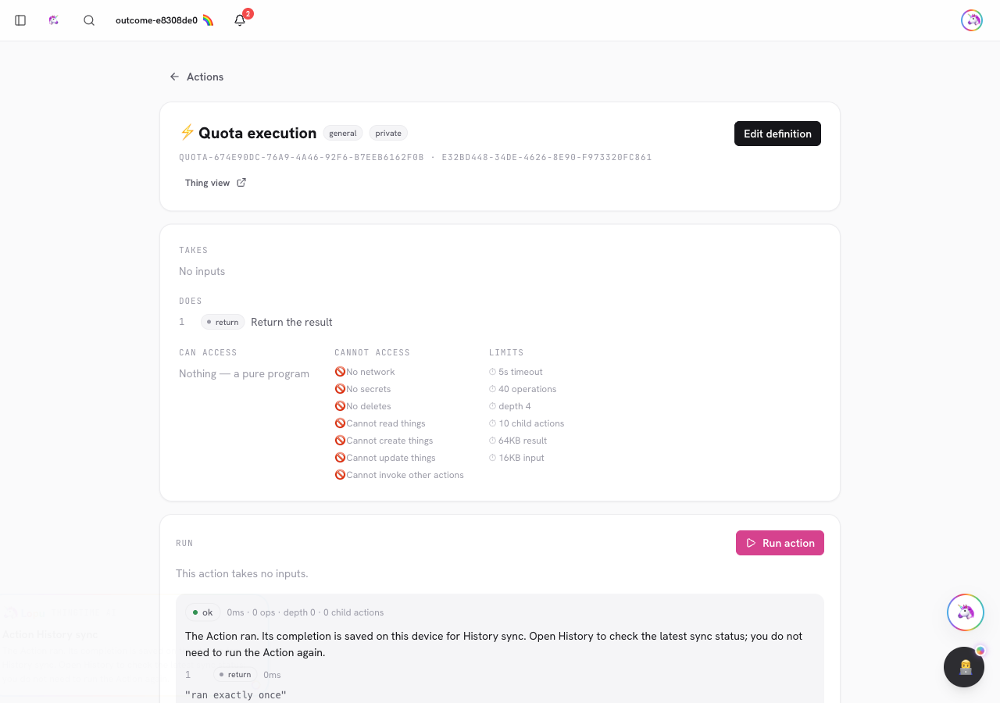
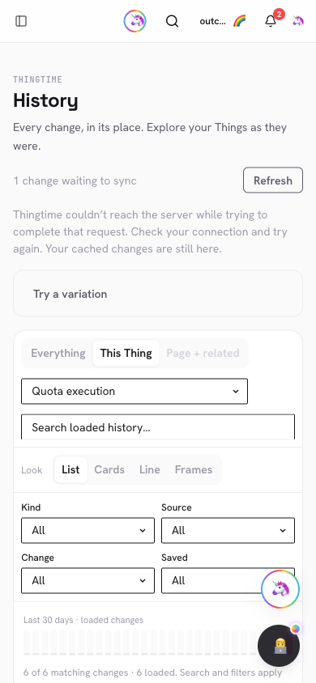
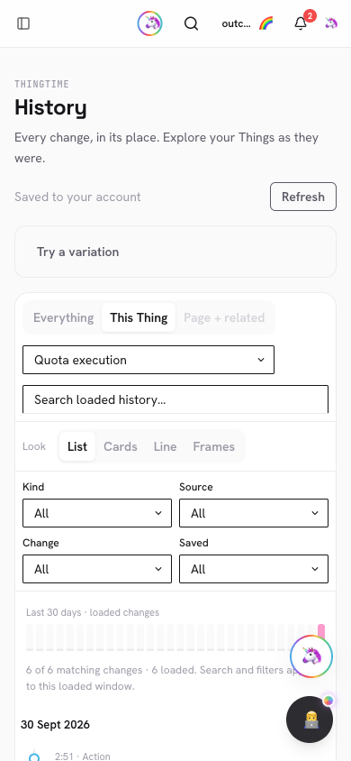
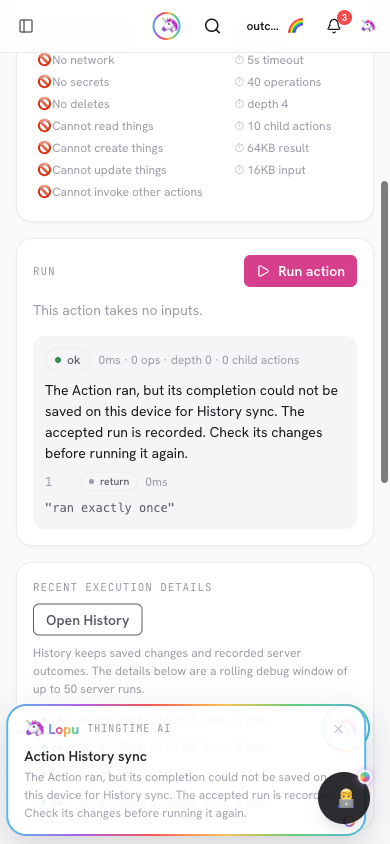

# PR #988 — Recover Action completion history without rerunning Actions

[PR](https://github.com/lopugit/thingtime/pull/988) ·
`codex/timeline-outcome-recovery` → `main`, built from
`e131a130b9361c4bd697abd405abaca022edbdc2`.

## Result

A known Action completion whose History write was not acknowledged returns the
exact event and a server content proof. The first-party client retains it in the
existing relational IndexedDB outbox under the original owner/origin/database;
reload/reconnect sends only that event to the existing Timeline endpoint. It
never executes the Action. Local retention failure preserves the actual result
and displays an honest warning. Fable's four looks use the same sync state.

Events and individual relationship records retain identical local/server
schemas. Only bounded delivery metadata is added to local bookkeeping. Proof
bytes count toward pending quota and disappear when a canonical receipt arrives.
Recovery authenticates the owner, verifies content/purpose/issuer/database and
original admission, then uses the existing metered transactional append. Exact
concurrent retries return one receipt/charge. Definitive refusals retain outcomes
and dependent work without indefinitely blocking unrelated drafts or branches.

## Validation and review

- 161 Timeline tests; 93 capability tests on both manifests; full unit suite.
- Full Vite/Nitro/Vercel build and output verification passed.
- Typecheck byte-identical to the prior 91-error baseline; targeted lint has
  zero errors (existing warnings). The integration script's TS lint passed.
- 100 existing Action API checks passed.
- Real disposable replica APIs: quota refusal before execution, completion-only
  quota failure, valid recovery, tampering/foreign-owner/anonymous refusal,
  exact schemas, concurrent idempotence, one storage charge, no Action replay.
- Headed 1280/390 browser: local retention warning, pending event after reload,
  exact recovery after reconnect, one execution request, cleared pending badge,
  all four looks, mobile detail bounds, no restore/replay, logout privacy and
  zero page errors. A second real run with Timeline IndexedDB deliberately
  unavailable preserved the result and rendered the mobile warning correctly.
- Source/security review checked key separation from sessions/challenges,
  explicit ES256/HS256 algorithms, no dev fallback, immutable identity,
  owner/data-plane/issuer/database fences, trusted admission matching, quota,
  stopped connections, local proof accounting and lost acknowledgements.

The isolated QA runtime used a private temporary signing key and a synthetic
admin allowlist for quota API checks. Admin access is withdrawn after testing.
No authenticated production mutation is part of acceptance. Generated graph
refresh is a separate commit. Final exact-head CI, preview and production
observations are recorded in the PR body after delivery.

## Limits

Configured auth signing keys are needed to seal recovery; README documents fork
setup. The known dev fallback and short legacy secrets are refused. Proofs have
no expiry, but removing the signing key invalidates pending proofs; retained
local outcomes remain visible and unrelated work can sync. No new key store or
historical verification-key registry is introduced.

Only a known response retained by a client can be recovered. Process crashes
before a result, responses lost before delivery, browser execution receipts and
remaining protected writers are still on the universal Timeline ledger. This PR
does not mark that broader goal complete or add a parallel history system.
