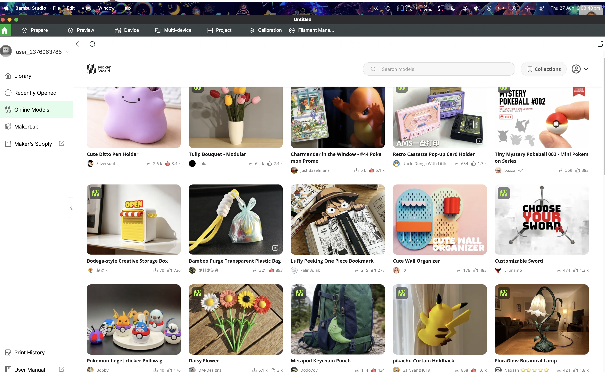

# 20 — Versioned experience history: return to any moment 🕰️

**Status:** 🔴 Not started · **Priority:** P1 fundamental · requested
2026-08-27.

## Principle

A user should be able to leave Thingtime and later return to any meaningful
state they remember from their experience: a search and its results, a
generated or algorithmic feed, a route with its filters and sort, the pages
they had loaded, and where they were looking within that state.

This is a fundamental Thingtime promise, not a per-screen bookmarking feature.
Apps routinely discard valuable generated states. In Bambu Studio's Online
Models view, for example, a user can receive a great curated set of prints, close
the app, and never see that exact recommendation set again unless they opened
and saved every model individually. Thingtime should make the experience itself
revisitable.

_Reference supplied with the request: Bambu Studio's Online Models feed. The
whole generated result state is valuable, not only the items the user happened
to open or like._

## Required experience

### Automatic history

- Capture a checkpoint whenever a meaningful view settles or materially
  changes: navigation, applied search/filter/sort, algorithm or feed generation,
  loaded result pages, selected tab/item, and significant scroll/viewport
  position. Do not snapshot every keystroke, animation frame, hover, or transient
  loading state.
- Flush the newest settled checkpoint on page hide/app close using the existing
  latest-revision persistence discipline. A crash may lose the final unsettled
  interaction, but must not corrupt earlier history.
- Give each checkpoint an honest timestamp and human-readable context such as
  `Online Models · Recommended · 27 Aug, 9:03 pm`, with optional user naming,
  pinning, and notes.
- Keep history navigable through a global **History** timeline plus contextual
  **Earlier versions** actions on searchable/generated surfaces. Search by
  route, query, date, source app/surface, and item that appeared in the results.

### Restore, compare, and continue

- Opening a checkpoint first renders the last-known historical state from cache,
  including the original result membership and order, then safely reconciles
  availability in the background. Never replace it immediately with today's
  rerun and call that a restore.
- Clearly label **Historical snapshot** with its capture time and source
  version. Offer **Return to now**, **Continue from here**, and **Run again with
  current data** as distinct actions.
- Restoring is non-destructive: it creates a new present session/branch and
  never rewrites or truncates later history. Browser back/forward and the
  existing short-lived undo/redo timeline remain separate concepts.
- Preserve enough context to resume the experience—route, query inputs,
  filters, sort, selected algorithm/version, ordered results, pagination depth,
  selected item/tab, and scroll anchor—without pretending an expired cursor or
  changed remote service can reproduce the past.
- Let users explicitly save/pin a moment before experimenting, but do not make
  manual saving a prerequisite for recovery.

## Snapshot contract

Use one versioned envelope across Thingtime surfaces and registered app
integrations. A checkpoint needs, at minimum:

- immutable snapshot id, owner id, capture time, device/session id, and parent
  snapshot id when the user continues from history;
- surface/app identity, canonical route, view-state schema id/version, and
  capture-format version;
- normalized query/search/filter/sort inputs and the source algorithm/model id
  plus revision/version when applicable;
- ordered result references and bounded cached display projections, grouped into
  pages/chunks with stable scroll anchors;
- pagination state and the number of results/pages actually seen—not an
  assumption that an old opaque cursor will remain valid;
- completeness, freshness, and reconciliation metadata so partial/offline
  captures and items now unavailable are represented honestly; and
- a content hash for deduplication and idempotent retry.

Store each `experience-snapshot` as its own private Thing. Store accumulating or
large result pages as bounded relational `experience-snapshot-page` children
linked by `parentId`, never as an unbounded embedded history array. All reads and
writes go through dedicated Thingtime API utilities and versioned collections.
Signed-in history syncs across devices; guest history remains device-local
unless the user explicitly adopts it into an account.

## Versioning and replay rules

- Version the snapshot envelope and each surface's view-state adapter
  independently. Migrations are deterministic, tested, and never execute code
  from stored state.
- A historical replay uses the captured ordered result set and cached safe
  projection. A current rerun uses today's data and current algorithm; the UI
  must never blur those modes.
- Record enough provenance to explain why exact regeneration may differ, but do
  not store secrets, raw model prompts, private ranking weights, access tokens,
  or third-party credentials in the snapshot.
- If an adapter is no longer supported, show a durable read-only representation
  and the raw safe query/filter summary instead of silently dropping the entry
  or guessing at a migration.
- Capture and restore must be idempotent. Concurrent device writes preserve both
  branches; a latest-write race must not erase a valid checkpoint.

## Privacy, retention, and control

- History is private to its owner by default. Sharing or publishing a snapshot
  is a separate explicit feature with a privacy-safe projection, never an
  accidental consequence of sharing an item that appeared within it.
- Re-authorize every referenced item on restore. Deletion, moderation takedown,
  revoked access, blocks, and visibility changes override historical cache;
  preserve the place in the layout as **No longer available** without leaking
  the old content or why access changed.
- Encrypt server-held private snapshot payloads consistently with Thingtime's
  protected user state, exclude them from generic Things/search/feed APIs, and
  never put private queries or result titles in logs, analytics, notifications,
  or unprotected indexes.
- Provide per-entry delete, delete-by-date/surface, retention settings, storage
  usage, export, and **Clear history**. Pinned checkpoints survive automatic
  retention but remain deletable by the user.
- Bound snapshots, result chunks, frequency, and total storage. Coalesce
  identical settled states and apply quota-aware degradation (for example,
  retain query + ordered ids before dropping safe display cache) instead of
  silently stopping capture.
- Registered/third-party surfaces must declare a bounded, serializable state
  adapter and a redaction policy. DOM dumps, screenshots, arbitrary runtime
  objects, tokens, and opaque app memory are not acceptable state capture.

## Delivery shape

1. Define the versioned snapshot envelope, redaction rules, retention/quota
   policy, and per-surface adapter contract.
2. Ship a vertical slice for Thingtime `/feed` and advanced search: automatic
   checkpoints, exact ordered replay, scroll restoration, timeline discovery,
   and current rerun.
3. Add durable API-backed account sync and relational page chunks, preserving a
   local first-paint cache for optimistic restore.
4. Expand to other first-party routes, then expose the bounded adapter contract
   to registered app integrations.
5. Add compare/branch, naming/pinning, export/delete controls, and storage
   management after the restore contract is proven.

## Done when

- A user loads several pages of a generated feed, closes the app, returns later,
  and restores the same captured item order, filters, algorithm/version label,
  pagination depth, selected context, and scroll anchor without having saved
  each item.
- Search snapshots survive navigation, relaunch, offline startup, account
  switch, and cross-device sync; private history never appears to another
  account using the same browser/device.
- **Restore historical**, **Continue from here**, and **Run again now** behave as
  distinct, tested flows, and returning to the present never destroys the
  historical or newer branches.
- Duplicate capture, rapid state changes, crash recovery, quota pressure,
  concurrent devices, format migration, unsupported adapter, and corrupt/partial
  checkpoint tests pass without losing the last known-good history.
- Deleted, moderated, blocked, or newly private results are unavailable on
  replay, while still-accessible results render immediately from the safe cache
  and reconcile in the background without a loading flash.
- Users can find, name, pin, export, delete, and retention-manage their history;
  clearing history deletes both server and local copies through an auditable,
  idempotent flow.
- Desktop and mobile browser checks cover timeline navigation, long result
  lists, restore/branch/rerun, offline mode, unavailable items, retention
  controls, and keyboard/screen-reader operation.

## Existing anchors

- `remix/app/Providers/ThingtimeProvider.tsx` — current whole-state LocalForage
  hydration and latest-revision persistence boundary.
- `remix/app/Providers/latestRevisionAutosave.ts` — debounced, ordered,
  latest-revision write coordination and page-hide flush behavior.
- `remix/app/hooks/useThingtimeMachine.tsx` — current in-memory undo/redo
  timeline; explicitly not the durable experience-history contract.
- `remix/app/components/Feed/Feed.tsx` — current algorithm/filter/search pager
  and the first vertical-slice surface.
- `remix/app/components/Feed/AdvancedFilters.tsx` — normalized advanced-search
  state and search request construction.
- `remix/app/components/Feed/useFeedEngagement.ts` — current session/algorithm
  provenance that must be captured without exposing private telemetry.
