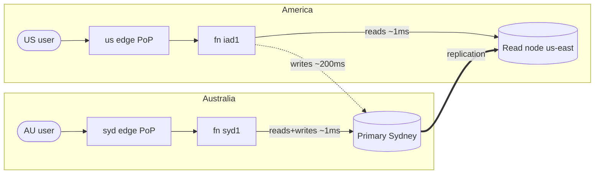

# Geo-distributing Thingtime — one URL, region-local speed, one source of truth

*Research + architecture notes, 2026-08-08. Status: proposal for review — nothing here is built yet.*

*Re-verified against `develop` on 2026-08-26: every code seam this doc leans on
still exists and still behaves as described. Two things moved since drafting —
the Vercel region pin now lives in the **root** `vercel.json` (`remix/vercel.json`
is gone), and Fluid Compute is **enabled**, so Phase 3 has one fewer prerequisite.
Both are corrected inline. The vendor pricing and plan-gating figures in §7 are
still as of 2026-08-08 and should be re-checked before any purchase.*

The ask: users in Australia **and** America (and everywhere else) get region-local
server + database latency, while `thingtime.com` stays the one URL and the data
stays a single logical source of truth — just spread out.

This doc lays out where we are, the building blocks we already own, three
architecture options in increasing order of ambition, why the middle one is the
right next move, and a staged migration plan with costs and verification steps.

---

## 1. Where we are today (post PR #157/#159/#161, measured 2026-08-08)

Everything currently lives in **Sydney**: Vercel functions pinned to `syd1`
(the root [vercel.json](../../vercel.json) — the region pin used to live in
`remix/vercel.json`, which `develop` has since removed), Atlas cluster in AWS
Sydney (M0 free tier). Measured from AU: warm feed **~430ms**, function→DB
ping **2ms**, anonymous feed/search served from the edge cache at **~65ms**.

What a US-East user experiences today, per API call:

```
US user ──~5ms──▶ US edge PoP ──~200ms──▶ syd1 function ──1-2ms×N──▶ Sydney Atlas
```

One ocean crossing per request (~200ms), then all N database round trips are
local. That's the payoff of colocating compute with data: remote users pay the
distance **once**, not N times. A US user's warm feed is roughly 600-700ms
today — usable, not delightful.

Two things are already global:

- **The static shell** — Vercel's anycast edge serves it from the nearest PoP
  worldwide (~60ms anywhere). One URL, no work needed: this is also why the
  "one thingtime.com" requirement is already solved at the DNS/routing layer.
- **Anonymous feed/search** — PR #157's `anon=1` responses carry
  `s-maxage=60, stale-while-revalidate=300` and are cached at the edge.
  A logged-out reader in Berlin or Boston gets ~60ms responses right now.
  (Nuance from §7: Vercel's CDN cache is per-region, so each region's *first*
  anon reader per minute warms it for that region — everyone after rides it.)

So the remaining problem is precisely: **authenticated/dynamic requests for
far-away users pay one ~200ms ocean crossing**. Geo-distribution is about
deleting that crossing for reads (easy-ish) and writes (hard).

## 2. Constraints this design must respect

From [FUNDAMENTALS.md](../../FUNDAMENTALS.md) and
[DECISIONS.md](../../DECISIONS.md):

1. **Single source of truth.** One logical dataset. No forked realities, no
   "US database and AU database that drift". Replication is fine; divergence
   is not.
2. **Everything-is-a-thing.** One `things` collection (physically
   `things_v2`) holds posts, comments, reactions, users-as-things, app-data,
   messenger spaces… distinguished by `thingtime`, a **multikey array** of
   type tags (`['post']`, `['post','comment']`, …); the scalar `kind` field is
   the retired v1 name, still read only through an era-compatibility `$or`.
   Any sharding story has to work for *this* shape, not an idealized
   per-domain schema — and the multikey discriminator matters: **a multikey
   field cannot be part of a shard key**, so `thingtime` is unavailable as a
   shard-key component in §5.3 no matter how convenient it looks.
3. **Unique indexes are load-bearing.** Usernames, emails, `uniqueKeys`,
   per-(target, owner, emoji) reaction uniqueness, per-(owner, app, key)
   app-data uniqueness, messenger `crystal.*Key`s. §5.3 explains why this is
   THE constraint that makes naive sharding painful.
4. **Transactions exist now.** `withMongoTransaction`
   ([collections.ts](../../remix/app/api/utils/mongodb/collections.ts)) runs
   storage-accounting writes with `readConcern: snapshot`,
   `writeConcern: majority`, `readPreference: primary`. Multi-region designs
   must keep these on the primary and accept their latency from remote regions.
5. **Test == live cohesion.** Whatever we do must degrade gracefully to a
   single-node local dev Mongo (dev doesn't get a replica fleet).

## 3. Primitives we already own (this matters — most of the plumbing exists)

| Primitive | Where | Why it matters for geo |
|---|---|---|
| Anycast edge, one URL | Vercel platform | Region routing for free; users always hit the nearest PoP |
| Anonymous edge caching | PR #157, `anon=1` contract in [feed](../../remix/app/routes/api/v1/things/feed/_feed.tsx)/[search](../../remix/app/routes/api/v1/things/search/_search.tsx) routes | Logged-out readers are already region-local; pattern extends to more endpoints |
| **Home vs data-plane endpoint split** | [mongodb/endpoint.ts](../../remix/app/api/utils/mongodb/endpoint.ts) + [collections.ts](../../remix/app/api/utils/mongodb/collections.ts) (`getClientCachedFor(uri, isHome)`, `getHomeThingtimeDb`) | The codebase ALREADY routes identity/auth/control-plane to the home cluster while the data plane can resolve elsewhere per request, via AsyncLocalStorage. A "regional data plane" is the same seam with the region picked by geography instead of by user override. |
| Per-URI client cache with serverless-tuned options | collections.ts (`maxPoolSize: 10`, 5s fail-fast, `appName`) | Multiple regional clients per instance are already safe |
| Boot-time index/connection warmup | [server/plugins/mongo-warmup.ts](../../remix/server/plugins/mongo-warmup.ts) | Cold instances in ANY region warm themselves without user-visible cost |
| Optimistic rendering house rule | CLAUDE.md, reactionOverlay, provisional comments | The UX layer that makes eventual consistency invisible: users see their own actions instantly regardless of replication lag |
| Cross-deployment sync — ⚠️ **proposed, not owned yet** | PR #175, still **open** against `develop`; `remix/app/api/utils/deployments/` exists only on its branch, not on `develop` | Related but different axis: it syncs *separate* deployments (envs/forks). Geo-distribution below stays one logical cluster — but if we ever wanted federated regional deployments instead, this is the primitive that would grow into it, once it lands. |

## 4. The shape of the problem: reads vs writes, own-data vs global-data

Thingtime's traffic splits four ways, and each cell has a different geo answer:

|  | Reads | Writes |
|---|---|---|
| **Global content** (feed, search, others' profiles/posts) | The overwhelming majority of traffic. Needs region-local replicas of *everything* — an AU user's feed contains US users' posts. | n/a |
| **Own data** (my posts, my app-data, my settings, my sessions) | Region-local if replicas exist | Posting, reacting, commenting — must land on ONE authoritative writer to stay single-source-of-truth |

The key insight: **a social feed is global-content-read-heavy.** This is what
decides §5's recommendation. Geo-sharding (splitting data by user home region)
optimizes own-data operations, but every feed page still needs posts from every
region. Replication (every region holds a full copy) optimizes exactly what
Thingtime does most.

## 5. The three architectures

### 5.1 Option A — Read-local, write-global (multi-region replica set) ⭐ recommended next step

One Atlas replica set, nodes in multiple regions. Sydney keeps the primary
(all writes); US-East (and later EU) get **read-only nodes**. Vercel functions
run multi-region; each region's functions read from their nearest node and
send writes to the Sydney primary.



- **One connection string** (Atlas SRV) — the driver discovers the topology
  and, with `readPreference` set, routes reads to the nearest node and writes
  to the primary automatically. No app-level routing code. (Plain `nearest`
  with **no** `readPreferenceTags` is both sufficient and the only safe form
  here — §7 shows why reaching for a `nodeType:READ_ONLY` tag to say "read from
  my region's read-only node" would instead send every Sydney read to us-east.)
- **Electable-node placement rule** (from Atlas's own latency guidance): all
  3 voting nodes stay in Sydney so `w: majority` acknowledges locally
  (~14ms); remote regions get *read-only* nodes. Spreading voters across
  oceans would put a ~200ms crossing inside every write's ack — the one
  configuration mistake that would make this slower than today.
- **Search comes along for free**: Atlas Search's coupled deployment runs on
  read-only nodes too, indexing locally — `$search`/ranked search honors the
  same read preference, so US searches run against the US node (§7).
- **US reads become ~1-5ms** instead of ~200ms. Feed, search, profiles,
  sessions — the bulk of every request — go region-local.
- **Writes stay globally consistent** (single primary = single source of
  truth, unique indexes keep working exactly as today, `withMongoTransaction`
  unchanged). A US user's post/react pays one ~200ms hop to Sydney — same as
  they pay today, but now it's only the *write* leg, not every read around it.

**Consistency story (the part to internalize):** read-only nodes replicate
asynchronously — typically well under a second behind, but not zero.
Two mitigations, both cheap:

1. **Read-your-own-writes:** after a write, that user's next reads must see
   it. MongoDB *causal sessions* guarantee it server-side — though only at
   `majority` read+write concern, and only within a single session, which on
   serverless means within one invocation (§7). But note we
   already solve most of this in the UI: the optimistic-rendering house rule
   paints your post/reaction instantly from local state, and the write
   response returns the authoritative doc. The remaining gap (hard refresh
   within a second of posting) is covered by passing the session's
   `afterClusterTime` or simply reading the writer's own recent content with
   `readPreference: primaryPreferred` for a short window.
2. **Staleness bounds:** `maxStalenessSeconds` on the read preference caps how
   far behind a node may lag before the driver abandons it (driver minimum is
   90s — steady-state lag is a few hundred ms per §7's measurement, so this is
   a circuit breaker, not the norm). For a social feed, sub-second staleness is
   indistinguishable from fresh.

**Code changes (small, and they degrade to a single-node dev Mongo cleanly):**

- Read-preference plumbing: default connection options gain
  `readPreference=nearest` (or `secondaryPreferred`) + `maxStalenessSeconds`
  for the data-plane reads; `withMongoTransaction` and the auth-critical
  reads (session revocation checks, login) stay `primary`/`primaryPreferred`
  explicitly. On a single-node dev Mongo, `nearest` == the one node — zero
  behavior change locally (constraint §2.5 ✅).
- Rate limiter: today every limited request does two sequential Mongo writes —
  an upsert followed by a conditional `findOneAndUpdate`, plus a third read on
  the reject path ([enforce.ts](../../remix/app/api/utils/rateLimit/enforce.ts)).
  From a US function that's ~400ms of cross-region round trips *before the route
  does any work* — unacceptable.
  Options, in preference order: (a) make limit state regional-best-effort —
  an in-memory per-instance window backed by a *regionally cached* read of
  the config (limits are per-user/IP heuristics, not financial invariants;
  fail-open already exists as a mode); (b) keep Mongo-backed limits only on
  failClosed routes (they're rare and admin-ish); (c) a regional KV
  (Upstash/Vercel KV) later if we want strict global limits again.
- Vercel: add the second region to `regions` in the root `vercel.json` —
  **plan gating applies, see §7 table**. (Fluid Compute was still a to-do when
  this was written; it has since been enabled — `"fluid": true` is in the root
  `vercel.json`, confirmed at the 2026-08-26 re-verification.)
- Nothing changes in the data model. This option is a *topology* change, not
  a *schema* change. Rollback = remove the read nodes + revert to one region.

**When A is not enough:** US *writes* still cross the ocean (~200ms + write
round trips). After the round-trip diets in the performance backlog
([performance/TODO.md](../../performance/TODO.md) — the react write path is
spread across its N+1, index-coverage and unbounded-scan sections), a US react
≈ 200ms + a handful of primary round trips ≈ 600ms-1s. Fine for v1 of geo;
§5.2 fixes it properly.

### 5.2 Option B — A + write forwarding (single-hop remote writes)

Same topology as A, plus: instead of a US function talking to the Sydney
primary N times (N sequential write-path round trips × 200ms), the US function
**forwards the whole write request** to a Sydney-region function in one hop,
which executes all N round trips locally and returns the finished response.

```
US user → us-east fn:  reads locally (1ms)
                       POST /things/react → forward → syd1 fn → N×1ms → done
                       total write cost ≈ 1 × 200ms + ~50ms, regardless of N
```

Mechanically on Vercel this is cleaner than it sounds — **no second project
or domain needed**. Thingtime deploys via the Build Output API, and Build
Output `config.json` routes support **HTTP `methods` matching** plus regex
`src`, while each emitted `.func` directory carries its own `.vc-config.json`
with a per-function `regions` array ([Vercel Build Output docs —
configuration](https://vercel.com/docs/build-output-api/configuration) and
[primitives](https://vercel.com/docs/build-output-api/primitives)). So the
build can emit the SAME Nitro server bundle twice:

- `api-read.func` → `regions: ["syd1", "iad1", ...]` — serves GET/HEAD
- `api-write.func` → `regions: ["syd1"]` — serves POST

with two `config.json` route entries splitting by method. (The API surface is
exactly GET/HEAD/POST: the catch-all sends GET/HEAD to a route's `loader` and
everything else to its `action`, and answers 405 with `Allow: GET, POST` —
there are no PUT/PATCH/DELETE routes to place.) One URL, one deployment,
writes always execute next to the primary, reads always execute next to the
user.

⚠️ **The split cannot be purely method-based — three cron routes mutate on
GET.** Vercel invokes cron jobs with GET, so all three jobs declared in the
root `vercel.json` do their writing in a `loader`:
`/api/v1/attachments/cleanup`, `/api/v1/moderation/sweep`, and
`/api/v1/notifications/email/weekly-summary`. The first two are GET-*only* by
design (their `action` returns 405 `Allow: GET`), so they cannot be
reclassified as POST without changing the cron contract. Their work is exactly
the shape that must not cross an ocean — `sweepUnmoderatedTextThings` walks a
batch issuing one `things.updateOne` per document, and `reapExpiredAttachments`
reaps per attachment — yet on a multi-region read plane they are no longer
guaranteed to execute in `syd1`, turning each batch into N × ~200ms. That is
the precise cost B exists to delete. So the write plane must be selected by
**path OR method**: pin those three cron paths to `syd1` beside the POST rule.
Cheap to get right up front; silent and expensive to get wrong.

(Fallbacks if ever needed: Routing Middleware `rewrite()`
runs globally and can geo-route, and external rewrites can reverse-proxy to a
second region-pinned project — but the microfrontends/multi-project route
costs $250/project/mo past the included two, so the single-deployment split
is also the cheap option.) The app is already shaped for this: every write is
a self-contained POST route behind
[server/routes/api/[...].ts](../../remix/server/routes/api/%5B...%5D.ts), and
`remix/scripts/patch-vercel-output.mjs` already post-processes the Build
Output — the natural home for emitting the split.

B is an optimization *layer* on A — adopt it per-endpoint, starting with the
chattiest writes (react, comment), only if A's measured US write latency
annoys real users. It also pairs beautifully with the round-trip diets in the
performance backlog: fewer RTs shrinks the gap A leaves, possibly making B
unnecessary.

### 5.3 Option C — Zone-sharded Global Cluster ("true" sharding)

What "sharding Thingtime" literally means in Atlas terms: a sharded cluster
whose shard key starts with a location field; Atlas **zones** pin each
region's key-range to hardware in that region. AU users' documents *live* in
Sydney; US users' documents *live* in Virginia. Writes are region-local too —
this is the only option where a US user's post commits without crossing an
ocean.

The honest costs, which is why this is the *later* option:

1. **Schema surgery on the everything-is-a-thing model.** Every doc needs a
   shard-key location field (e.g. `homeRegion` stamped at signup, inherited
   by the user's things). That's a migration touching every document plus
   write-path changes to stamp it.
2. **Unique indexes stop working as-is.** On a sharded collection, unique
   indexes must be *prefixed by the shard key*. `{ homeRegion, ownerId,
   crystal.username }` cannot enforce **global** username uniqueness — two
   users in different zones could claim the same name. The standard fix: keep
   an **unsharded (or single-zone) identity/reservation collection** on the
   primary shard — global uniqueness enforced there (username, email,
   uniqueKeys, app clientIds), content sharded by zone. Conveniently, that is
   *exactly* the home-vs-data-plane split endpoint.ts already draws: identity
   home-pinned, content distributed. But reactions' and app-data's unique
   indexes live on `things_v2` itself and would need the reservation
   treatment or shard-key-compatible redesigns. Real work.
3. **The feed becomes scatter-gather.** A feed/search query without the shard
   key fans out to every zone — cross-region latency = the slowest shard, on
   every page. Mitigations exist (regional feed materialization,
   fan-out-on-write to per-region feed caches) but that's a second
   architecture on top. §4's global-content-read-heavy insight is exactly why
   C's strength (local own-data writes) doesn't match Thingtime's dominant
   workload today.
4. **Tier jump.** Global Clusters require **M30+ sharded** — the 2-zone floor
   is ~$980/mo before extras (§7), ~7× a fully built-out Option A (~$134/mo
   with both the US and EU read nodes; Phase 1 alone is ~$112). Also: the shard
   key is set once and **cannot be resharded later**, must be exactly
   `{location-first, one-secondary-field}` with ISO country codes, and
   dedicated Search Nodes are unsupported with Global Writes. This is a
   "Thingtime has real regional user bases and write volume" purchase, not a
   latency tweak.

C is the right eventual destination *if* write locality becomes the
bottleneck (large active US community posting constantly). It composes with
A/B: the identity plane stays home-pinned, replicas keep serving global
reads, zones localize content writes.

### 5.4 Rejected: per-region independent databases with app-level sync

Two full deployments (thingtime-au, thingtime-us) syncing each other via the
cross-deployment sync feature proposed in PR #175. Rejected as the *primary*
architecture because it forfeits constraint §2.1 — conflict resolution, sync
lag, and split-brain uniqueness (same username registered in both regions
simultaneously) all move into app code, which is the hardest version of this
problem. If that sync feature lands it stays the right tool for what it was
built for (branch/env data flows, federated forks) — not for intra-product geo.

## 6. Recommendation + staged plan

**Recommendation: A now (when ready), B if measured write latency warrants,
C when regional scale demands it.** Each stage is independently shippable and
reversible, in DECISIONS.md spirit (determinism, single source of truth,
verify with live measurements — same curl methodology as PRs #157/#161).

| Phase | What | Prereqs | Effect |
|---|---|---|---|
| **0. Round-trip diets** | The open round-trip items in [performance/TODO.md](../../performance/TODO.md) — chiefly its "Database — N+1 and per-item round trips" and "connection lifecycle" sections, and the single-RT rate limiter | none | Shrinks every gap A leaves; makes B likely unnecessary for years |
| **1. Paid tier + topology dry run** | M0 → M10 (Sydney, 3 electable). Add one us-east read-only node. Functions stay syd1-only. | budget: **~$112/mo** (§7) | No user-visible change; validates replication, lag metrics, backup story. Rollback: remove node. |
| **2. Read-preference plumbing** | `nearest` (**untagged** — §7) + `maxStalenessSeconds` for data-plane reads; explicit `primary` for auth-critical + transactions; regional rate-limit strategy | Phase 1 | Still no user change (one region) — but code is now region-ready and dev-parity is proven. Probe AU here too: this is the phase where a stray `readPreferenceTags` would silently move Sydney's reads offshore |
| **3. Second function region** | `regions: ["syd1", "iad1"]` in the root `vercel.json` | **Vercel Pro plan** (multi-region isn't on Hobby, §7). Fluid Compute was the other prereq here and is already done (`"fluid": true` in the root `vercel.json`, confirmed 2026-08-26) | 🎉 US users: reads drop ~200ms → ~5ms. Measure from a US probe before/after (curl from a US VPS or Vercel cron in iad1). |
| **4. Write forwarding (optional)** | Dispatcher-level forward of mutating routes to primary region | Phase 3 + real US-user write-latency data | US writes ≈ single hop |
| **5. EU node/region (repeat 1+3)** | fra1/lhr1 + eu read node | traffic justifies | EU joins the party |
| **6. Zone sharding (C)** | homeRegion stamping, identity-reservation collection, M30+ Global Cluster, regional feed strategy | genuine regional write scale | Region-local writes; the full "spread out but single truth" end-state |

**Verification at every phase** (the methodology that caught the state-C
regression in PR #161): probe from BOTH sides of the ocean — AU curl suite +
a US-located probe — cold and warm, before/after. Never trust a single-region
measurement of a multi-region change.

## 7. Platform facts + pricing (researched 2026-08-08)

> ⚠️ This section is filled from current vendor docs at research time —
> re-verify plan gating and prices before purchasing.

### Vercel (researched from official docs/changelog, links inline)

- **Multi-region functions plan gating**: Hobby = 1 region; **Pro = up to 5
  regions**; Enterprise = all ([region config docs, updated
  2026-07-15](https://vercel.com/docs/functions/configuring-functions/region)).
  Caveat: the [Fluid docs](https://vercel.com/docs/fluid-compute) still say
  "up to 3" for Pro — docs disagree with each other; check the dashboard
  before relying on regions 4-5. Either way: **Phase 3 requires the Pro plan**
  (multi-region is not available on Hobby). Over-configuring fails the
  deployment before build, so a wrong guess is loud, not silent.
- **Routing**: per-request, to the geographically closest *configured* region
  — exactly the behavior we want, no code involved.
- **Per-function regions**: supported both in `vercel.json` (`functions` glob
  → `regions`) and — what Thingtime actually uses — per-`.func`
  `.vc-config.json` `regions` in the [Build Output
  API](https://vercel.com/docs/build-output-api/primitives). Route entries in
  Build Output `config.json` support `methods` matching → the §5.2
  read/write split-plane needs no middleware and no second project.
- **Fluid Compute** ([docs](https://vercel.com/docs/fluid-compute)): available
  on all plans, default for new projects since 2025-04-23. Thingtime predates
  that and needed an explicit opt-in; **that has since happened** — the root
  `vercel.json` carries `"fluid": true` (enabled 2026-08-17, in the same
  commit that moved the region pin to the root file), so this is a
  prerequisite already met rather than an outstanding one. What it buys us:
  in-function concurrency
  (many requests share one instance → far fewer Mongo connection pools),
  **scale-to-one** (≥1 instance kept warm up to 14 days on Pro production,
  explicitly including multi-region functions — [blog
  2025-09-18](https://vercel.com/blog/scale-to-one-how-fluid-solves-cold-starts))
  which largely retires our cold-start concerns, and **Active CPU pricing**
  where CPU billing pauses while a request waits on Mongo I/O — Thingtime's
  requests are exactly that shape. Region rates differ slightly (syd1
  $0.180/CPU-hr + $0.0149/GB-hr vs iad1 $0.128 + $0.0106 —
  [pricing](https://vercel.com/docs/functions/usage-and-pricing)).
- **CDN cache is per-region, not global** ([CDN cache
  docs](https://vercel.com/docs/cdn-cache)): our anon `s-maxage` responses
  warm independently in each of ~20 compute regions (PoPs route into
  regions). Still great — each region's second anon reader gets ~60ms — plus
  2025/26 additions we can use later: **cache tags** with ~300ms global purge
  (`Vercel-Cache-Tag` / `invalidateByTag()`), enabling longer anon TTLs
  invalidated precisely on new posts. Authed responses remain CDN-uncacheable
  by design (Authorization/cookie criteria) — regional replicas are the only
  way to make authed reads local, which is the whole point of §5.1.
- **Vercel's own guidance** agrees with the plan ordering: colocate compute
  with the database first; multi-region compute is positioned as the compute
  half of database read-replica strategies ([region
  docs](https://vercel.com/docs/functions/configuring-functions/region),
  [3-region changelog](https://vercel.com/changelog/pro-customers-can-now-configure-up-to-3-regions-for-vercel-functions)).
- **Region picks with exact Atlas AWS counterparts**: `iad1`↔us-east-1,
  `fra1`↔eu-central-1 (or `lhr1`↔eu-west-2), `syd1`↔ap-southeast-2 — a
  3-region layout fits Pro's cap with room to add `sfo1`/`pdx1` later.
- **Atlas is on the Vercel Marketplace** (unified billing, auto `MONGODB_URI`)
  but multi-region topology is configured Atlas-side — there is no Vercel
  template for it; treat it as an Atlas exercise (§ below).

### MongoDB Atlas (researched from official docs + live pricing calculator, 2026-08-08)

- **Multi-region needs M10+** (dedicated) — M0/Flex cannot distribute nodes
  ([multi-cloud distribution docs](https://www.mongodb.com/docs/atlas/cluster-config/multi-cloud-distribution/)).
  So Phase 1's M0→M10 jump is unavoidable for any geo story.
- **Topology for Option A**: keep **all 3 electable nodes in Sydney** and add
  **read-only nodes** in remote regions. This is load-bearing: `w: majority`
  then acks entirely intra-Sydney (~14ms); spreading electables across oceans
  (2+2+1) would put an ocean crossing inside *every write's* majority ack
  ([latency strategies](https://www.mongodb.com/docs/atlas/architecture/current/latency-strategies/)).
  Read-only nodes never vote and exist exactly for "optimal local reads in
  their respective regions".
- **Targeting local nodes is config, not code — and the config is bare
  `nearest`**: `readPreference=nearest` with **no** `readPreferenceTags` is
  exactly what makes "one global SRV connection string everywhere" work. The
  driver ranks every node by measured RTT, so syd1 functions land on the Sydney
  electables (~1ms) and iad1 functions land on the us-east read-only node
  (~1ms) — no per-region config at all.
  ⚠️ **Do not add `readPreferenceTags=nodeType:READ_ONLY` to express "my
  region's read-only node".** Tag sets are matched **in order, first match
  wins** — "MongoDB tries each document in succession until a match is found…
  the remaining tag sets are ignored" — and latency is applied only *after* tag
  filtering
  ([read preference tag sets](https://www.mongodb.com/docs/manual/core/read-preference-tags/)).
  Under Option A's topology the only `READ_ONLY` nodes are overseas, so that
  tag set always matches, the empty fallback is never reached, and **every
  Sydney read is routed to us-east** — a ~200ms regression for today's entire
  user base, shipped by the phase §6 bills as "no user change". Alongside the
  electable-placement rule in §5.1, this is the second configuration mistake
  that would make this slower than today.
  If tags are ever wanted deliberately (e.g. to keep ordinary reads off the
  primary), two syntax facts: the empty fallback is a *separate*
  `&readPreferenceTags=` parameter, not a trailing comma inside one tag set;
  and correct targeting is by `region`, per Atlas's own example
  `…&readPreferenceTags=provider:AWS,region:US_EAST_1&readPreferenceTags=`
  ([replica set tags](https://www.mongodb.com/docs/atlas/reference/replica-set-tags/)).
  That is inherently *per-region* config — a connection option derived from
  `VERCEL_REGION` at boot, not one global string.
- **Pricing** (official calculator, AWS, 2026-08-08; cluster-only, backup off):

  | Config | ~Monthly |
  |---|---|
  | M10 3-node Sydney (today's shape, paid) | $92 (Sydney premium: us-east equivalent is $60) |
  | **M10 Sydney + 1 read-only us-east-1** (Phase 1) | **~$112** *(derived per-node math — the real mixed-region number only shows in the cluster builder UI)* |
  | + 1 read-only EU node (Phase 5) | ~$134 *(quoted at eu-west-1, the cheapest EU region; the `fra1`/`lhr1` picks recommended above map to eu-central-1/eu-west-2, which price slightly higher)* |
  | M20 same 5-node shape (headroom tier) | ~$330 |
  | M30 Global Cluster, 2 zones (Option C floor) | **~$980** + cross-zone read-only nodes + transfer |

  Plus backup ($0.14/GB/mo) and cross-region replication transfer
  (~$0.02/GB by the 2022-dated official AWS rates; AU pairs may run higher —
  unconfirmed). MongoDB's own guidance note: most customers spend <10% of
  budget on transfer.
- **Staleness mechanics**: replication is async; steady-state lag ≈ one-way
  network delay + apply time (measured Sydney↔us-east RTT: 201ms, so think
  "a few hundred ms" not seconds). `maxStalenessSeconds` has a hard **minimum
  of 90s** — it is an outage circuit-breaker, not a freshness SLA; UX-level
  tolerance (optimistic rendering) is the real freshness strategy
  ([staleness docs](https://www.mongodb.com/docs/manual/core/read-preference-staleness/)).
- **Read-your-own-writes**: causal sessions guarantee it only at
  readConcern+writeConcern `majority`, and a causal session lives within one
  function invocation — cross-request continuity would need `clusterTime`
  forwarding. Pragmatic social-app pattern (endorsed by the docs' own
  latency guidance): author's immediately-following reads go
  `primary`/`primaryPreferred`; everyone else reads nearest; the client
  optimistic layer hides the sub-second window.
- **Atlas Search goes region-local for free in Option A**: default (coupled)
  deployment runs the `mongot` search process **on every node including
  read-only nodes**, each indexing its own node's data, and `$search` honors
  read preference/tags — so regional functions can run search against their
  local node ([deployment options](https://www.mongodb.com/docs/atlas/atlas-search/about/deployment-options/),
  [search FAQ](https://www.mongodb.com/docs/atlas/atlas-search/faq/)).
  Dedicated Search Nodes (production-grade, S-tiers, min 2/region) are
  multi-region GA and Sydney-supported — but **not supported with Global
  Writes enabled**, another strike against Option C for search-heavy use.
- **Sharding facts for Option C** (all official):
  - Global Clusters: **M30+ sharded**, up to 9 zones; shard key must be
    exactly `{location-first, one-secondary-field}` where location is an
    ISO-3166 country/subdivision code already present on every doc;
    **no resharding after the fact**; sample data can't even load
    ([global clusters](https://www.mongodb.com/docs/atlas/global-clusters/),
    [shard a global collection](https://www.mongodb.com/docs/atlas/shard-global-collection/)).
  - Unique indexes only work when prefixed by the shard key
    ([limits](https://www.mongodb.com/docs/manual/reference/limits/)); the
    **official workaround is the proxy/reservation collection** (unique index
    on a small side collection, insert there first —
    [tutorial](https://www.mongodb.com/docs/manual/tutorial/unique-constraints-on-arbitrary-fields/))
    — i.e. §5.3's identity-plane split is the documented pattern, not a hack.
  - `$search`/`$text` on sharded collections are scatter-gather across all
    shards (cross-region latency on every search under zoned shards).
  - TTL indexes (sessions, rateLimits) work fine on both replica sets and
    sharded clusters. Cross-shard transactions work but cost more;
    single-shard transactions perform like replica-set ones.
- **Dead ends confirmed dead**: Atlas Edge Server and Device Sync were
  EOL'd (Sept 2025) — there is no MongoDB-native edge/sync product to lean
  on; Atlas Flex is single-region only. A globally-replicated KV (e.g.
  Upstash global Redis: primary region + read regions, <1ms local reads,
  eventually consistent) remains a viable *complement* for regional feed-page
  caching if we ever want it on top of Option A.

## 8. Open questions for Lopu

1. **Budget comfort zone** — Phase 1 is the first monthly bill: **~$112/mo**
   for M10 Sydney + a US read node (+ Vercel Pro if not already on it, for
   Phase 3's multi-region functions). Worth it now, or park this doc until
   there's a US user cohort? (Vercel Analytics can tell us where visitors
   actually are before we spend.)
2. **Staleness tolerance** — is "a US user might see an AU post a few hundred
   ms late" acceptable? (§7: steady-state lag ≈ the measured 201ms
   Sydney↔us-east delay plus apply time. Recommendation: yes — the
   optimistic-rendering rule already embraces this philosophy for the author's
   own view.)
3. **Rate limits** — OK with regional-best-effort limits on ordinary routes
   (strict Mongo-backed limits retained only on failClosed routes)?
4. **Which second region first** — US-East (iad1 + us-east-1) is the default
   for cost/coverage; US-West or EU could argue otherwise depending on where
   early users actually are (Vercel Analytics can tell us).
