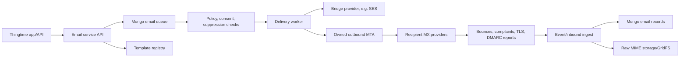

# Thingtime Owned Email Architecture

This document is the plan for moving Thingtime from provider-mediated email
delivery toward an owned email stack. The short-term bridge can still use SES or
another provider, but the long-term goal is to own the queue, policy engine,
templates, event log, inbound parsing, outbound SMTP path, suppression logic,
and sender reputation operations.

Self-hosting removes a provider approval gate, such as waiting for SES
production access. It does not remove receiver-side trust gates. Gmail, Yahoo,
Microsoft, corporate gateways, and blocklist operators can still throttle,
spam-folder, or reject mail from infrastructure that lacks authentication,
clear consent, healthy engagement, abuse handling, or a warm reputation. The
owned stack is therefore an operations and compliance project, not just an SMTP
daemon.

This document is planning guidance, not legal advice.

## Goals

- Send transactional email for signup verification, email OTP, password reset,
  service-account verification, account notifications, and security alerts.
- Send newsletters and product updates only to opted-in recipients.
- Store outbound attempts, delivery events, inbound messages, bounces,
  complaints, suppressions, unsubscribe state, and template revisions in
  MongoDB-backed Thingtime records.
- Keep raw MIME available for debugging, compliance, and user-visible inbox
  features without putting oversized documents into ordinary Mongo records.
- Avoid lock-in to SES, SendGrid, Mailgun, Google Workspace, or any other
  single sender.
- Preserve deliverability of account/security email if newsletter reputation
  suffers.
- Make every production send auditable, replay-safe, rate-limited, and
  suppressible.

## Non-goals

- Do not send production user mail from serverless or edge workers directly.
  Outbound SMTP wants stable IPs, PTR/rDNS, durable queues, retry state, and
  feedback-loop operations.
- Do not bypass recipient-domain standards or anti-abuse systems.
- Do not operate an open relay or accept unauthenticated third-party injection.
- Do not send newsletters before consent records, unsubscribe handling, and
  suppression handling are live.
- Do not store DKIM private keys, SMTP auth secrets, or API credentials in
  MongoDB.

## Recommended Direction

Use a dual-track migration:

1. Keep the app integrated through the Mongo-backed email service boundary.
   The web app and auth code should enqueue email through Thingtime's email
   service only, never call SES or SMTP directly from feature code.
2. Keep SES or another reputable provider as a bridge while the owned control
   plane, queues, templates, events, suppressions, and compliance paths are
   built.
3. Bring up a self-hosted SMTP lab on a dedicated, stable IP and a separate
   subdomain. Use it only for internal and opted-in canary traffic at first.
4. Promote low-volume transactional traffic only after authentication,
   monitoring, bounce processing, complaint processing, unsubscribe handling,
   and throttling pass readiness checks.
5. Promote newsletter traffic last, on a separate stream, after list hygiene,
   one-click unsubscribe, and warm-up controls are proven.

## Architecture



### Application Boundary

All app sends should pass through a single internal module:

- `sendTransactionalEmail()`
- `sendNewsletterEmail()`
- `sendSecurityEmail()`
- `sendEmailOtp()`
- `sendVerificationEmail()`

Those functions enqueue a message and return an internal message id. They do
not directly open SMTP connections. The worker owns delivery.

That boundary already exists as the single `sendEmail({ stream, ... })` in
`remix/app/api/utils/email/service.ts`; the named helpers above are a proposed
ergonomic layer over it, not a replacement. Today's callers are
`api/utils/auth/email.ts` (transactional and newsletter) and
`api/utils/notifications/` (notification). Note that `EmailStream` already has
**three** members — `transactional`, `newsletter`, and `notification` — each
with its own From address in `email/config.ts`. There is no `security` stream;
security mail rides the transactional one. Any new helper must map onto those
existing streams rather than introducing a fourth name for the same traffic.

### Mongo Collections

**Most of this already exists — extend it, do not rebuild it.** Seven of the
collections below are already registered in
`remix/app/api/utils/mongodb/collections.ts` (with indexes in `ensureIndexes()`)
and documented in `FUNDAMENTALS.md` §3: `email_messages`, `email_events`,
`email_templates`, `email_subscriptions`, `email_suppression_list`,
`email_unsubscribes`, and `email_identities`. Only **`email_inbound_messages`**
and **`email_delivery_limits`** are new. Likewise, the send-API surface above is
a proposed refinement of the existing `sendEmail()` in
`remix/app/api/utils/email/service.ts` — not a second, parallel email path.
Reach every collection through the named getters, never a raw name string
(`FUNDAMENTALS.md` §3).

Collections, with the two new ones marked:

- `email_messages`: durable send records, stream, recipient, template version,
  idempotency key, status, retry counters, provider/MTA ids, and metadata.
- `email_events`: append-only event stream for queued, rendered, sent,
  deferred, delivered, bounced, complained, unsubscribed, rejected, opened, and
  clicked events.
- `email_templates`: versioned subject/text/html templates with test fixtures.
- `email_identities`: approved From domains, DKIM selectors, stream ownership,
  and sender policy.
- `email_subscriptions`: newsletter topics, consent source, consent timestamp,
  consent proof, and preference state.
- `email_suppression_list`: permanent or timed suppression records from hard
  bounces, complaints, manual blocks, and unsubscribe-all.
- `email_unsubscribes`: tokenized unsubscribe requests, one-click requests, and
  body-link preference changes.
- `email_inbound_messages` **(new)**: inbound/reply metadata, routing target,
  parsed participants, spam verdict, and raw MIME pointer.
- `email_delivery_limits` **(new)**: per-domain, per-stream, per-IP, and global
  throttles.

Raw MIME can exceed MongoDB's normal document limits. Store large raw MIME in
object storage or Mongo GridFS and keep a content hash plus storage pointer in
Mongo. If the goal is strict Mongo ownership, use GridFS rather than embedding
large MIME blobs in ordinary documents.

### Streams And Domains

Keep transactional and marketing reputation separate:

- Human inboxes: keep Google Workspace MX on `thingtime.com`.
- Outbound SMTP host: `mail.thingtime.com`.
- Bounce handling: `bounce.thingtime.com`.
- Transactional/auth stream: `auth.thingtime.com` or `mail.thingtime.com`.
- Newsletter stream: `news.thingtime.com`.
- Notification stream (weekly summaries and activity digests, the existing
  `notification` stream): decide deliberately whether it shares the
  transactional domain or gets its own. It is subscribed, recurring, digest
  mail, so its complaint profile is closer to newsletter than to auth — but
  routing it through `news.thingtime.com` would let a marketing reputation
  problem take account digests down with it. Whichever is chosen, it needs its
  own SPF/DKIM/DMARC coverage; the DNS block below currently provisions only
  `auth.` and `news.`.
- Inbound app-managed replies: `inbound.thingtime.com` or
  `reply.thingtime.com`.
- Abuse and postmaster contacts: `abuse@thingtime.com` and
  `postmaster@thingtime.com` must route to monitored inboxes.

Use different DKIM selectors and, once volume justifies it, different IP pools
for transactional and newsletter traffic. A newsletter complaint spike must not
damage signup or security-code delivery.

## SMTP Hosting Plan

### Infrastructure

Run the MTA on stable infrastructure, not edge/serverless:

- Dedicated static IPv4, and optionally IPv6 after IPv4 reputation is stable.
- Provider that allows legitimate outbound port 25 and supports custom PTR.
- Hostname with forward-confirmed reverse DNS:
  `mail.thingtime.com -> sending IP -> mail.thingtime.com`.
- Firewall that exposes only required ports:
  - `25/tcp` for SMTP delivery and inbound MX if used.
  - `587/tcp` only for authenticated internal submission if needed.
  - `465/tcp` only if explicitly supporting implicit TLS submission.
  - SSH/VPN admin access restricted by IP or private network.
- Disk-backed queue with durable retry state.
- Immutable server build or configuration management so the MTA can be rebuilt.
- Metrics, logs, and alerting before production user traffic.

Candidate first stack:

- Postfix for outbound SMTP and durable queueing.
- OpenDKIM or Rspamd for DKIM signing.
- Rspamd for policy checks, spam scoring on inbound, rate limits, and ARC later
  if Thingtime becomes a forwarder.
- OpenDMARC or a custom parser for inbound aggregate/report processing.
- A Thingtime delivery worker that injects messages locally through a locked
  submission socket or authenticated loopback submission.

Postal, Mailu, Mailcow, Haraka, or OpenSMTPD can be evaluated, but the first
production path should prefer boring, inspectable components over a large
opaque bundle.

### DNS And Authentication

Minimum DNS for each sending stream:

```text
mail.thingtime.com.          A      <smtp-ipv4>
<smtp-ipv4 reverse PTR>      PTR    mail.thingtime.com.

auth.thingtime.com.          TXT    "v=spf1 ip4:<smtp-ipv4> -all"
news.thingtime.com.          TXT    "v=spf1 ip4:<newsletter-ipv4> -all"
selector1._domainkey.auth.thingtime.com. TXT "v=DKIM1; k=rsa; p=<2048-bit-public-key>"
selector1._domainkey.news.thingtime.com. TXT "v=DKIM1; k=rsa; p=<2048-bit-public-key>"
_dmarc.auth.thingtime.com.   TXT    "v=DMARC1; p=none; rua=mailto:dmarc@thingtime.com; adkim=s; aspf=s"
_dmarc.news.thingtime.com.   TXT    "v=DMARC1; p=none; rua=mailto:dmarc@thingtime.com; adkim=s; aspf=s"
```

Progress DMARC intentionally:

1. `p=none` while collecting reports and fixing alignment.
2. `p=quarantine` after legitimate sources are aligned.
3. `p=reject` after monitoring shows no legitimate failures.

Authentication requirements:

- SPF must include every service allowed to send for the domain and nothing
  else.
- DKIM must sign every message with 2048-bit keys when DNS allows it.
- DKIM keys must be rotated by introducing a new selector, deploying signing,
  waiting for old mail to age out, then removing the old selector.
- DMARC must align the visible `From:` domain with either the SPF envelope
  domain or the DKIM `d=` domain.
- SPF is evaluated against the **envelope** sender (`MAIL FROM`/Return-Path),
  not the `From:` header. A separate bounce domain therefore needs its own SPF
  record: if bounces use `bounce.thingtime.com`, that name — not just `auth.`
  and `news.` — must publish `v=spf1 ip4:<smtp-ipv4> -all`.
- Resolve the bounce-domain/alignment conflict before publishing DMARC. The
  `aspf=s` shown above is *strict* SPF alignment, which requires the envelope
  domain to equal the `From:` domain exactly, so a `bounce.thingtime.com`
  Return-Path under an `auth.thingtime.com` From will always fail SPF
  alignment and leave DKIM as the only passing path. Either use `aspf=r`
  (relaxed — both names share the `thingtime.com` organizational domain, so
  they align), or keep the Return-Path on the same subdomain as `From:`. Do not
  ship `aspf=s` with a split bounce domain and then treat the resulting
  aggregate-report failures as the warm-up policy's "unexpected failures".
- Transactional and newsletter streams must use stable From addresses.
- Do not use `gmail.com`, `googlemail.com`, or other third-party domains in
  `From:` headers.

Recommended transport trust:

```text
_mta-sts.thingtime.com.      TXT    "v=STSv1; id=<version>"
_smtp._tls.thingtime.com.    TXT    "v=TLSRPTv1; rua=mailto:tlsrpt@thingtime.com"
```

Host the MTA-STS policy at:

```text
https://mta-sts.thingtime.com/.well-known/mta-sts.txt
```

Use DANE/TLSA only after DNSSEC is correctly deployed and monitored. Use BIMI
only after DMARC is enforced strongly enough for the brand requirements and the
logo/certificate process is worth the operational overhead.

## Compliance Requirements

### Consent

Marketing/newsletter sends require a consent record:

- who consented,
- email address,
- source form or workflow,
- timestamp,
- IP/user-agent when available,
- exact language shown at opt-in,
- topic/list,
- double-opt-in confirmation when used,
- current subscription state.

Do not buy lists. Do not infer consent loosely. Do not make newsletter opt-in
checked by default.

### Identification

Commercial emails must identify Thingtime clearly:

- accurate From display name and address,
- accurate Reply-To,
- accurate subject,
- no deceptive `Re:`/`Fwd:` prefixes,
- visible sender/business contact information,
- postal address or legally acceptable mailbox for jurisdictions that require
  it,
- correct legal/business identity where required.

### Unsubscribe

Marketing and subscribed messages must include:

- visible unsubscribe or preference link in the email body,
- `List-Unsubscribe` header,
- `List-Unsubscribe-Post: List-Unsubscribe=One-Click` header,
- HTTPS one-click endpoint that does not require login,
- signed/opaque unsubscribe token that identifies recipient and list,
- immediate suppression update in Mongo,
- no fee, login, or extra personal information requirement,
- provider-specific deadlines met: 2 days for Yahoo expectations, 5 working
  days for Australian Spam Act compliance, and 10 business days for US
  CAN-SPAM compliance.

Transactional security emails do not usually need marketing unsubscribe, but
they must not include promotional content that changes the message's primary
purpose. If a transactional stream attracts complaints, consider a safety
unsubscribe or frequency-control option for non-critical notices while keeping
security-critical messages deliverable.

### Privacy And Retention

- Classify raw MIME as sensitive user data.
- Encrypt raw MIME at rest.
- Restrict admin access to message bodies.
- Redact secrets and OTPs from routine logs.
- Define retention periods per stream. Security/audit metadata may live longer
  than raw message content.
- Support account deletion and suppression-list retention without accidentally
  re-subscribing a deleted user.
- Keep suppression records long enough to avoid re-contacting unsubscribed or
  complained recipients.

## Deliverability And Trust Checklist

Before sending production traffic from the owned MTA:

- SPF, DKIM, and DMARC pass for every stream.
- PTR/rDNS and forward DNS match the sending hostname.
- TLS works for outbound SMTP.
- MTA-STS and TLS-RPT are deployed or explicitly deferred.
- Gmail Postmaster Tools is configured.
- Yahoo Sender Hub and Complaint Feedback Loop are configured.
- Microsoft SNDS/JMRP or current Microsoft sender monitoring is configured.
- `abuse@thingtime.com` and `postmaster@thingtime.com` are monitored.
- Hard bounces suppress immediately.
- Complaints suppress immediately.
- Soft bounces defer with exponential backoff and max-age.
- One-click unsubscribe is live and tested.
- Message-ID, Date, From, To, Reply-To, and MIME formatting are valid.
- HTML has a text alternative.
- Links use trusted Thingtime domains and do not hide their destination.
- Rate limits exist per recipient domain, stream, IP, and account.
- Queue depth, deferrals, bounce rates, complaints, and provider-specific SMTP
  responses have alerts.
- Blocklist monitoring is in place.
- Warm-up schedule starts with engaged recipients and avoids bursts.

## Warm-up Policy

Start with internal and highly engaged recipients only:

1. Day 1-3: owned/test addresses only.
2. Week 1: low-volume transactional canaries, manual review of every bounce and
   complaint.
3. Week 2-4: gradual transactional ramp by recipient domain.
4. Newsletter: separate ramp only after transactional stability, beginning with
   recent double-opt-in subscribers.

Use adaptive throttles:

- If a provider returns 4xx deferrals, reduce concurrency and retry later.
- If spam complaints approach 0.1%, pause growth and inspect content/list
  source.
- If complaints approach 0.3%, stop the affected stream.
- If hard bounces spike, suppress and investigate the list source.
- If DMARC or TLS reports show unexpected failures, pause that stream until
  fixed.

## Security Requirements

- No open relay. Relay only from authenticated internal users/services or
  loopback/private-network delivery workers.
- Separate production, staging, and local sender credentials.
- DKIM private keys stored in filesystem secrets, KMS, or another secret store,
  not in MongoDB.
- Principle-of-least-privilege access for queue workers and admin UIs.
- Signed idempotency keys so repeated API calls do not send duplicate OTPs or
  verification emails.
- Rate-limit OTP, password reset, register, resend verification, and newsletter
  sends by IP, account, recipient, and session.
- Abuse detection for mail bombing, signup flooding, and recipient enumeration.
- Admin UI for sending must require Thingtime admin roles and audit every
  preview/send/export action.
- Inbound parser must treat HTML, attachments, and MIME as hostile input.
- Attachments need size limits, malware scanning, and content-type validation.
- Never render raw inbound HTML without sanitization.
- Backups must include queue state, template versions, event history, and
  suppression lists.

## Implementation Roadmap

### Phase 0: Provider Bridge

- Keep SES as the bridge when approved.
- Keep all app code behind the Thingtime email service boundary.
- Add Mongo collections and indexes for `email_inbound_messages` and
  `email_delivery_limits`. The other seven are already registered and indexed —
  see the collections section above.
- **Wire the event stream.** `recordEmailEvent()` exists in
  `email/events.ts` but currently has no callers: `service.ts` does not import
  it, so `email_events` is registered and indexed yet receives no rows. Today
  `sendEmail()` records state only as mutable `status` transitions on the
  `email_messages` row, which means a message's history is overwritten rather
  than accumulated. Emitting `queued`/`sent`/`logged`/`skipped`/`failed` events
  from `sendEmail()` is the smallest change that makes the append-only trail
  real, and it must land before provider webhooks start appending
  `delivered`/`bounced`/`complained` to the same stream.
- **Wire the suppression writers too — the whole module is unreferenced.** It is
  not only `recordEmailEvent()`: `email/events.ts` also exports
  `suppressEmailAddress()` and `unsubscribeEmailAddress()`, and those are the
  *only* writers to `email_suppression_list` and `email_unsubscribes` anywhere
  in the app. Nothing imports any of the three. So `getSuppressedRecipients()`
  runs on every send but queries two collections that no code path can populate,
  and it will keep returning an empty list until a writer is wired. The check is
  structurally present and behaviourally vacuous. Both writers already normalize
  to trimmed lowercase, matching how `service.ts` normalizes recipients before
  the `$in` lookup, so wiring them is a call-site problem rather than a data
  problem. Land this alongside the event stream: bounce/complaint ingestion in
  Phase 1 has nowhere to write until it exists.
- Build deterministic template rendering tests.
- Add dev/test email endpoints that cannot leak credentials or send to
  arbitrary addresses.

Exit criteria:

- Signup verification, email OTP, password reset, and service-account
  verification are represented as queued message records.
- Every send attempt creates an event trail — specifically, `email_events` is
  non-empty for every `email_messages` row, which is not true today.
- Suppression checks happen before delivery **and can actually suppress** — a
  row written by `suppressEmailAddress()` demonstrably drops a recipient from a
  real send. Today the check runs against collections nothing writes to, so
  "the check ran" is not evidence that suppression works.

### Phase 1: Compliance Core

- Build subscription/preference center.
- **Reconcile the two opt-out systems that already exist, then build the
  one-click endpoint on top of the survivor.** Thingtime currently has two
  unrelated ways to stop mail:
  - The email service checks `email_suppression_list` for every stream, and
    `email_unsubscribes` **only** when `stream === 'newsletter'`
    (`getSuppressedRecipients()` in `email/service.ts`).
  - The notification path never reaches those collections. It gates on a user
    preference before calling `sendEmail()` at all
    (`notificationEmailChannelOn()`), and its footer link —
    `/api/v1/notifications/email/unsubscribe`, already HMAC-tokenised and
    rate-limited — flips `masters.email` on the user document.

  Opt-out is therefore correct today but not observable in one place: nothing
  in `email_unsubscribes` reflects a notification opt-out, and a suppression
  audit that reads only the email collections would report a user as
  subscribed after they unsubscribed. Pick one system of record before adding
  RFC 8058 headers, or the `List-Unsubscribe-Post` endpoint and the footer link
  will write to different stores.
- Build consent capture and proof records.
- Build bounce and complaint ingestion abstraction that can accept SES events
  now and owned-MTA events later.
- Add admin-only dashboards for queue status, bounces, complaints, and
  suppressions.

Exit criteria:

- Newsletter sends are impossible without consent.
- Unsubscribe-all suppresses every marketing topic immediately.
- Hard bounces and complaints suppress future sends.

### Phase 2: Self-hosted SMTP Lab

- Provision `mail-lab.thingtime.com` or a separate test subdomain on a stable
  IP.
- Configure PTR/rDNS, SPF, DKIM, DMARC, TLS, and queueing.
- Send only to owned test addresses and seeded mailbox accounts.
- Capture SMTP transcripts, headers, DMARC reports, TLS reports, bounces, and
  spam-folder placement.

Exit criteria:

- Mail passes SPF, DKIM, and DMARC at Gmail, Yahoo, Outlook, and Google
  Workspace test inboxes.
- Forward and reverse DNS pass.
- No open relay.
- Bounce classification is correct.

### Phase 3: Transactional Canary

- Move a tiny percentage of non-critical transactional email to the owned MTA.
- Keep SES/provider fallback available.
- Use per-domain throttles and automatic rollback on elevated 4xx, 5xx,
  bounce, or complaint signals.

Exit criteria:

- Stable inbox placement and low deferral rates for at least two weeks.
- No unexpected DMARC/TLS failures.
- Support can inspect every failed delivery without shell access.

### Phase 4: Transactional Production

- Move critical transactional email gradually, stream by stream.
- Keep provider fallback for incident response.
- Document incident playbooks for queue pause, provider failover, DKIM
  rollback, DNS rollback, and blocklist response.

Exit criteria:

- Owned MTA can handle normal transactional volume with stable reputation.
- Provider fallback has been tested.
- On-call/alerting paths are live.

### Phase 5: Newsletter Stream

- Use a separate newsletter domain/subdomain and preferably a separate IP.
- Send only to recent, provably opted-in recipients first.
- Add content QA gates for misleading subject lines, missing unsubscribe,
  broken links, image-only content, and spammy formatting.

Exit criteria:

- One-click unsubscribe and body unsubscribe are working.
- Complaint rate stays well below 0.3%.
- Bounce and complaint loops are continuously processed.

### Phase 6: Inbound And Replies

- Keep normal human mailbox MX at Google Workspace.
- Route app-managed inbound through a dedicated subdomain:
  `inbound.thingtime.com` or `reply.thingtime.com`.
- Parse inbound replies, bounces, and user commands into Mongo metadata.
- Store raw MIME in GridFS/object storage with content hashes.

Exit criteria:

- User replies can be associated with outbound messages.
- Abuse/report mail reaches humans.
- Inbound parser is hardened against malicious content.

### Phase 7: Redundancy And Portability

- Add a second MTA only after the first one is stable.
- Keep per-node DKIM, queue, logs, metrics, and blocklist monitoring distinct.
- Build export/import tooling for templates, suppressions, and event history.
- Test disaster recovery from backups.

Exit criteria:

- A single MTA outage does not lose queued mail.
- Rebuild process is documented and repeatable.
- Sender reputation is observable per IP and per domain.

## Open Decisions

- Whether raw MIME should live in Mongo GridFS or object storage with Mongo
  pointers.
- Whether the first owned MTA should be Postfix-based or a higher-level mail
  suite.
- Which VPS/provider offers the best port 25, PTR, abuse-desk, and IP
  reputation posture for Thingtime.
- Whether newsletter traffic should ever share IPs with transactional traffic.
- Whether Thingtime needs EU/UK-specific compliance review before broad
  newsletter sends.
- Whether BIMI is worth pursuing after DMARC reaches quarantine/reject.

## References

- Google Gmail sender guidelines:
  https://support.google.com/mail/answer/81126
- Yahoo Sender Hub best practices:
  https://senders.yahooinc.com/best-practices/
- Microsoft high-volume sender requirements:
  https://techcommunity.microsoft.com/blog/microsoftdefenderforoffice365blog/strengthening-email-ecosystem-outlook%E2%80%99s-new-requirements-for-high%E2%80%90volume-senders/4399730
- RFC 5321 SMTP:
  https://www.rfc-editor.org/rfc/rfc5321
- RFC 5322 Internet Message Format:
  https://www.rfc-editor.org/rfc/rfc5322
- RFC 6376 DKIM:
  https://www.rfc-editor.org/rfc/rfc6376
- RFC 7208 SPF:
  https://www.rfc-editor.org/rfc/rfc7208
- RFC 7489 DMARC:
  https://www.rfc-editor.org/rfc/rfc7489
- RFC 8058 one-click unsubscribe:
  https://www.rfc-editor.org/rfc/rfc8058
- RFC 8461 MTA-STS:
  https://www.rfc-editor.org/rfc/rfc8461
- RFC 8460 SMTP TLS reporting:
  https://www.rfc-editor.org/rfc/rfc8460
- FTC CAN-SPAM compliance guide:
  https://www.ftc.gov/business-guidance/resources/can-spam-act-compliance-guide-business
- ACMA avoid sending spam:
  https://www.acma.gov.au/avoid-sending-spam
